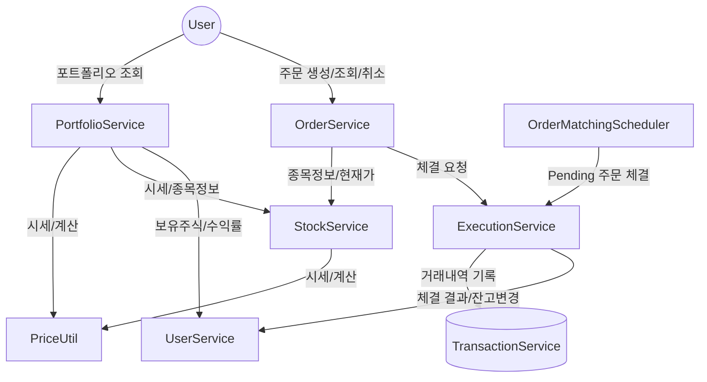

# 🏦 Motoo Backend (주식 모의투자 서비스)

## 1. 유즈케이스별 기능 정리

| 유즈케이스           | 주요 기능 설명                                                                                     |
| -------------------- | -------------------------------------------------------------------------------------------------- |
| **주문 생성**        | - 사용자가 매수/매도 주문을 생성 - 시장가/지정가 주문 지원 - 주문 유효성(잔고/보유주식) 검사 |
| **주문 체결**        | - Pending 주문을 주기적으로 조회 - 현재가와 주문가 비교 후 체결 - 체결 시 자산/보유주식 반영 |
| **포트폴리오 조회**  | - 사용자의 전체 자산, 보유 주식, 수익률, 평가금액 등 조회                                          |
| **종목/시세 조회**   | - 종목 검색, 현재가/시가/고가/저가/PER/EPS 등 정보 제공                                            |
| **거래내역 관리**    | - (예정) 주문/체결/입출금 등 거래 이력 관리                                                        |
| **시세 데이터 적재** | - 분단위로 한투 API에서 시세 데이터 수집, DB 적재                                                  |
| **종목 리스트 갱신** | - 한달에 한 번, 시가총액 상위 종목 리스트를 한투 API에서 갱신                                      |

---

## 2. 서비스별 주요 함수/역할

### UserService

- `getProfile(Long userId)`: 사용자 정보 및 자산 조회

### OrderService

- `placeOrder(Long userId, OrderRequest request)`: 주문 생성(시장가/지정가)
- `getOrders(Long userId)`: 주문 내역 조회
- `cancelOrder(Long userId, Long orderId)`: 주문 취소

### ExecutionService

- `getExecutions(Long userId)`: 체결 내역 조회
- `processOrderExecution(Long orderId, Long executedPrice)`: 주문 체결 처리

### PortfolioService

- `getPortfolio(Long userId)`: 포트폴리오(총자산, 수익률, 보유주식 등) 조회

### StockService

- `getStocks(Long userId)`: 전체 종목 조회
- `getStock(Long userId, String stockId)`: 종목 상세 조회
- `searchStocks(Long userId, StockSearchRequest request)`: 종목 검색

### OrderMatchingScheduler

- `matchOrders()`: 1분마다 Pending 주문 체결 시도

### (예정) TransactionService

- 거래내역 기록 및 조회

### 기타

- **InitDataLoader**: 초기 데이터 적재
- **SimulationRunner**: 테스트/시뮬레이션 실행
- **PriceUtil**: 실시간 시세 관리, 수익률 계산 등

---

## 3. 구현/미구현 기능 체크리스트

### ✅ 현재 구현된 기능

- [x] 사용자 정보/자산/보유주식 조회 (UserService)
- [x] 주문 생성/조회/취소 (OrderService)
- [x] 주문 체결 처리 (ExecutionService)
- [x] 포트폴리오 조회 (PortfolioService)
- [x] 종목 목록/상세/검색/시세 조회 (StockService)
- [x] 1분마다 주문 체결 스케줄러 (OrderMatchingScheduler)
- [x] 실시간 시세 관리 유틸 (PriceUtil)
- [x] Swagger/OpenAPI 문서화

### ⏳ 구현 예정/보완 필요 기능

- [ ] **시장가 주문(Market Order) 완전 지원** (OrderType에 MARKET 추가, 즉시 체결)
- [ ] **부분 체결/여러 번 체결 지원**
- [ ] **거래내역 관리 (TransactionService)**
- [ ] **분단위 시세 데이터 적재/DB화**
- [ ] **한달마다 종목 리스트 갱신 스케줄러**
- [ ] **회원가입/로그인/인증(JWT 등)**
- [ ] **테스트 코드 작성**
- [ ] **트랜잭션/동시성 처리 보완**
- [ ] **에러 메시지/코드 고도화**
- [ ] **주문/체결 내역 알림 기능(선택)**

---

## 4. 유즈케이스 다이어그램 및 설명

Mermaid 코드 보기/접기

### 💬 유즈케이스 설명

- **사용자**는 주문을 생성/조회/취소하고, 포트폴리오와 종목 시세를 조회할 수 있습니다.
- **OrderService**는 주문을 생성하고, 필요시 **ExecutionService**에 체결을 요청합니다.
- **ExecutionService**는 주문 체결을 처리하고, **UserService**를 통해 잔고/보유주식 정보를 갱신합니다.
- **PortfolioService**는 사용자의 전체 자산, 수익률, 보유주식 정보를 계산해 제공합니다.
- **StockService**는 종목 정보, 시세, 검색 기능을 제공합니다.
- **OrderMatchingScheduler**는 1분마다 Pending 주문을 자동으로 체결 시도합니다.
- **PriceUtil**은 실시간 시세, 수익률 계산 등 공통 유틸리티 역할을 합니다.
- (예정) **TransactionService**는 모든 거래내역을 기록/조회합니다.

---
