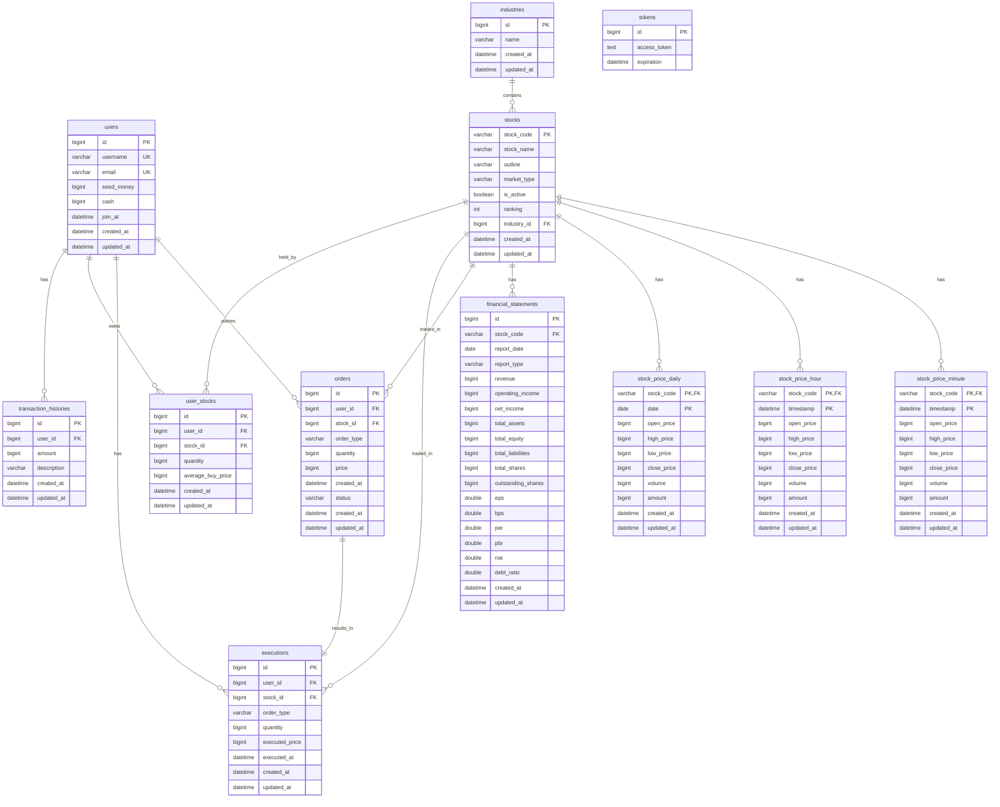

# Motoo Database Schema Documentation

## 📊 Database Entity Relationship Diagram

#### pdf url
[ERDCloud URL](https://github.com/mo2-motoo/backend/blob/main/docs/Motoo_ERD.pdf)
[ERD 다이어그램 pdf](https://github.com/mo2-motoo/backend/blob/main/docs/Motoo_ERD.pdf)

<details>
<summary>📋 ERD 다이어그램 보기/숨기기</summary>



</details>

## 🗄️ Database DDL (Data Definition Language)

```sql
-- Users table
CREATE TABLE users (
    id BIGINT AUTO_INCREMENT PRIMARY KEY,
    username VARCHAR(30) NOT NULL UNIQUE,
    email VARCHAR(50) NOT NULL UNIQUE,
    seed_money BIGINT NOT NULL,
    cash BIGINT NOT NULL,
    join_at DATETIME NOT NULL,
    created_at DATETIME NOT NULL DEFAULT CURRENT_TIMESTAMP,
    updated_at DATETIME NOT NULL DEFAULT CURRENT_TIMESTAMP ON UPDATE CURRENT_TIMESTAMP
);

-- Industries table
CREATE TABLE industries (
    id BIGINT AUTO_INCREMENT PRIMARY KEY,
    name VARCHAR(50) NOT NULL,
    created_at DATETIME NOT NULL DEFAULT CURRENT_TIMESTAMP,
    updated_at DATETIME NOT NULL DEFAULT CURRENT_TIMESTAMP ON UPDATE CURRENT_TIMESTAMP
);

-- Stocks table
CREATE TABLE stocks (
    stock_code VARCHAR(10) PRIMARY KEY,
    stock_name VARCHAR(50) NOT NULL,
    outline VARCHAR(255),
    market_type VARCHAR(20),
    is_active BOOLEAN NOT NULL DEFAULT TRUE,
    ranking INT,
    industry_id BIGINT,
    created_at DATETIME NOT NULL DEFAULT CURRENT_TIMESTAMP,
    updated_at DATETIME NOT NULL DEFAULT CURRENT_TIMESTAMP ON UPDATE CURRENT_TIMESTAMP,
    FOREIGN KEY (industry_id) REFERENCES industries(id)
);

-- Stock Price Minute table (복합키)
CREATE TABLE stock_price_minute (
    stock_code VARCHAR(10) NOT NULL,
    timestamp DATETIME NOT NULL,
    open_price BIGINT NOT NULL,
    high_price BIGINT NOT NULL,
    low_price BIGINT NOT NULL,
    close_price BIGINT NOT NULL,
    volume BIGINT NOT NULL,
    amount BIGINT,
    created_at DATETIME NOT NULL DEFAULT CURRENT_TIMESTAMP,
    updated_at DATETIME NOT NULL DEFAULT CURRENT_TIMESTAMP ON UPDATE CURRENT_TIMESTAMP,
    PRIMARY KEY (stock_code, timestamp),
    FOREIGN KEY (stock_code) REFERENCES stocks(stock_code)
);

-- Stock Price Hour table (복합키)
CREATE TABLE stock_price_hour (
    stock_code VARCHAR(10) NOT NULL,
    timestamp DATETIME NOT NULL,
    open_price BIGINT NOT NULL,
    high_price BIGINT NOT NULL,
    low_price BIGINT NOT NULL,
    close_price BIGINT NOT NULL,
    volume BIGINT NOT NULL,
    amount BIGINT,
    created_at DATETIME NOT NULL DEFAULT CURRENT_TIMESTAMP,
    updated_at DATETIME NOT NULL DEFAULT CURRENT_TIMESTAMP ON UPDATE CURRENT_TIMESTAMP,
    PRIMARY KEY (stock_code, timestamp),
    FOREIGN KEY (stock_code) REFERENCES stocks(stock_code)
);

-- Stock Price Daily table (복합키)
CREATE TABLE stock_price_daily (
    stock_code VARCHAR(10) NOT NULL,
    date DATE NOT NULL,
    open_price BIGINT NOT NULL,
    high_price BIGINT NOT NULL,
    low_price BIGINT NOT NULL,
    close_price BIGINT NOT NULL,
    volume BIGINT NOT NULL,
    amount BIGINT,
    created_at DATETIME NOT NULL DEFAULT CURRENT_TIMESTAMP,
    updated_at DATETIME NOT NULL DEFAULT CURRENT_TIMESTAMP ON UPDATE CURRENT_TIMESTAMP,
    PRIMARY KEY (stock_code, date),
    FOREIGN KEY (stock_code) REFERENCES stocks(stock_code)
);

-- Financial Statements table
CREATE TABLE financial_statements (
    id BIGINT AUTO_INCREMENT PRIMARY KEY,
    stock_code VARCHAR(10) NOT NULL,
    report_date DATE NOT NULL,
    report_type VARCHAR(10) NOT NULL,
    revenue BIGINT,
    operating_income BIGINT,
    net_income BIGINT,
    total_assets BIGINT,
    total_equity BIGINT,
    total_liabilities BIGINT,
    total_shares BIGINT,
    outstanding_shares BIGINT,
    eps DOUBLE,
    bps DOUBLE,
    per DOUBLE,
    pbr DOUBLE,
    roe DOUBLE,
    debt_ratio DOUBLE,
    created_at DATETIME NOT NULL DEFAULT CURRENT_TIMESTAMP,
    updated_at DATETIME NOT NULL DEFAULT CURRENT_TIMESTAMP ON UPDATE CURRENT_TIMESTAMP,
    FOREIGN KEY (stock_code) REFERENCES stocks(stock_code)
);

-- Orders table
CREATE TABLE orders (
    id BIGINT AUTO_INCREMENT PRIMARY KEY,
    user_id BIGINT NOT NULL,
    stock_id BIGINT NOT NULL,
    order_type VARCHAR(10) NOT NULL,
    quantity BIGINT NOT NULL,
    price BIGINT NOT NULL,
    created_at DATETIME NOT NULL,
    status VARCHAR(15) NOT NULL,
    created_at DATETIME NOT NULL DEFAULT CURRENT_TIMESTAMP,
    updated_at DATETIME NOT NULL DEFAULT CURRENT_TIMESTAMP ON UPDATE CURRENT_TIMESTAMP,
    FOREIGN KEY (user_id) REFERENCES users(id),
    FOREIGN KEY (stock_id) REFERENCES stocks(stock_code)
);

-- Executions table
CREATE TABLE executions (
    id BIGINT AUTO_INCREMENT PRIMARY KEY,
    user_id BIGINT NOT NULL,
    stock_id BIGINT NOT NULL,
    order_type VARCHAR(10) NOT NULL,
    quantity BIGINT NOT NULL,
    executed_price BIGINT NOT NULL,
    executed_at DATETIME NOT NULL,
    created_at DATETIME NOT NULL DEFAULT CURRENT_TIMESTAMP,
    updated_at DATETIME NOT NULL DEFAULT CURRENT_TIMESTAMP ON UPDATE CURRENT_TIMESTAMP,
    FOREIGN KEY (user_id) REFERENCES users(id),
    FOREIGN KEY (stock_id) REFERENCES stocks(stock_code)
);

-- User Stocks table
CREATE TABLE user_stocks (
    id BIGINT AUTO_INCREMENT PRIMARY KEY,
    user_id BIGINT NOT NULL,
    stock_id BIGINT NOT NULL,
    quantity BIGINT NOT NULL,
    average_buy_price BIGINT NOT NULL,
    created_at DATETIME NOT NULL DEFAULT CURRENT_TIMESTAMP,
    updated_at DATETIME NOT NULL DEFAULT CURRENT_TIMESTAMP ON UPDATE CURRENT_TIMESTAMP,
    FOREIGN KEY (user_id) REFERENCES users(id),
    FOREIGN KEY (stock_id) REFERENCES stocks(stock_code)
);

-- Tokens table
CREATE TABLE tokens (
    id BIGINT AUTO_INCREMENT PRIMARY KEY,
    access_token LONGTEXT,
    expiration DATETIME
);

-- Transaction Histories table
CREATE TABLE transaction_histories (
    id BIGINT AUTO_INCREMENT PRIMARY KEY,
    user_id BIGINT NOT NULL,
    amount BIGINT NOT NULL,
    description VARCHAR(100) NOT NULL,
    created_at DATETIME NOT NULL DEFAULT CURRENT_TIMESTAMP,
    updated_at DATETIME NOT NULL DEFAULT CURRENT_TIMESTAMP ON UPDATE CURRENT_TIMESTAMP,
    FOREIGN KEY (user_id) REFERENCES users(id)
);

-- Indexes for performance
CREATE INDEX idx_stocks_market_type ON stocks(market_type);
CREATE INDEX idx_stocks_is_active ON stocks(is_active);
CREATE INDEX idx_stock_price_minute_stock_timestamp ON stock_price_minute(stock_code, timestamp);
CREATE INDEX idx_stock_price_hour_stock_timestamp ON stock_price_hour(stock_code, timestamp);
CREATE INDEX idx_stock_price_daily_stock_date ON stock_price_daily(stock_code, date);
CREATE INDEX idx_financial_statements_stock_date ON financial_statements(stock_code, report_date);
CREATE INDEX idx_orders_user_status ON orders(user_id, status);
CREATE INDEX idx_executions_user ON executions(user_id);
CREATE INDEX idx_user_stocks_user ON user_stocks(user_id);
```

## 🎯 핵심 설계 포인트

### 1. **복합키를 활용한 시계열 데이터 설계**

**Stock Price Tables (Minute/Hour/Daily)**

- **복합키 사용 이유**: 동일한 종목의 여러 시점 데이터를 효율적으로 저장
- **성능 최적화**: 종목코드 + 시간으로 빠른 조회 가능
- **데이터 무결성**: 중복 데이터 방지

```java
// 복합키 클래스 예시
public class StockPriceMinuteId implements Serializable {
    private String stockCode;  // 종목코드
    private LocalDateTime timestamp;  // 시간
}
```

### 2. **Stock Entity의 Primary Key 설계**

**종목코드를 Primary Key로 사용**

- **이유**: 한국투자증권 API에서 종목코드가 고유 식별자
- **장점**: API 연동 시 자연스러운 매핑
- **성능**: 종목코드로 직접 조회 가능

```java
@Entity
public class Stock extends BaseEntity {
    @Id
    @Column(name = "stock_code", length = 10)
    private String stockCode;  // "005930" (삼성전자)
}
```

### 3. **재무제표 데이터의 정규화 설계**

**FinancialStatement Entity**

- **분리 이유**: 재무제표는 분기별/연간으로 업데이트되므로 별도 테이블 관리
- **계산된 지표 저장**: EPS, BPS, PER, PBR 등 미리 계산하여 저장
- **성능**: 실시간 계산 대신 저장된 값 사용

```java
@Entity
public class FinancialStatement extends BaseEntity {
    private Double eps;  // 주당순이익
    private Double bps;  // 주당순자산
    private Double per;  // 주가수익비율
    private Double pbr;  // 주가순자산비율
}
```

### 4. **사용자 포트폴리오 설계**

**UserStock Entity**

- **평단가 관리**: 매수 시마다 평균 매수가 자동 계산
- **수량 관리**: 보유 주식 수량 추적
- **성능**: 사용자별 포트폴리오 조회 최적화

```java
@Entity
public class UserStock extends BaseEntity {
    private Long quantity;           // 보유 수량
    private Long averageBuyPrice;    // 평균 매수가
}
```

### 5. **주문-체결 분리 설계**

**Order ↔ Execution 관계**

- **Order**: 주문 정보 (PENDING, COMPLETED, CANCELLED)
- **Execution**: 실제 체결 정보 (체결가, 체결시간)
- **이유**: 주문과 체결은 별도로 관리되어야 함

### 6. **BaseEntity를 통한 공통 필드 관리**

**모든 Entity가 상속하는 BaseEntity**

```java
public abstract class BaseEntity {
    @CreatedDate
    private LocalDateTime createdAt;

    @LastModifiedDate
    private LocalDateTime updatedAt;
}
```

### 7. **인덱스 전략**

**성능 최적화를 위한 인덱스**

- **종목별 시계열 조회**: `(stock_code, timestamp)`
- **사용자별 주문 조회**: `(user_id, status)`
- **활성 종목 조회**: `(is_active)`

### 8. **데이터 타입 선택**

**BIGINT 사용 이유**

- **주식 가격**: 한국 주식은 최대 1,000,000원까지 가능
- **거래량**: 대용량 거래량 처리
- **재무 데이터**: 대규모 기업의 재무 데이터

## 🔄 데이터 플로우

1. **종목 정보 수집** → `stocks` 테이블
2. **시세 데이터 수집** → `stock_price_*` 테이블들
3. **재무제표 수집** → `financial_statements` 테이블
4. **사용자 주문** → `orders` 테이블
5. **주문 체결** → `executions` 테이블 + `user_stocks` 업데이트
6. **포트폴리오 조회** → `user_stocks` + `stock_price_*` 조인

## 📈 확장성 고려사항

- **파티셔닝**: 시계열 데이터는 날짜별 파티셔닝 고려
- **샤딩**: 사용자별 데이터 샤딩 가능
- **캐싱**: 자주 조회되는 시세 데이터 Redis 캐싱
- **아카이빙**: 오래된 시세 데이터 아카이빙 전략

---

_이 문서는 Motoo 프로젝트의 데이터베이스 스키마 설계를 설명합니다._
