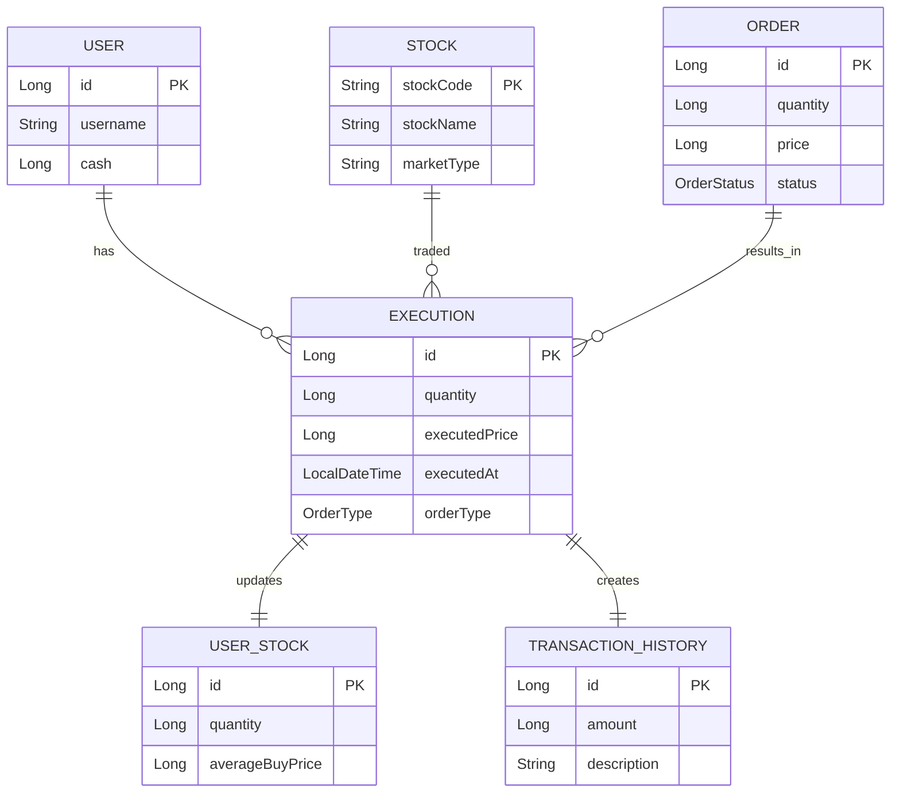
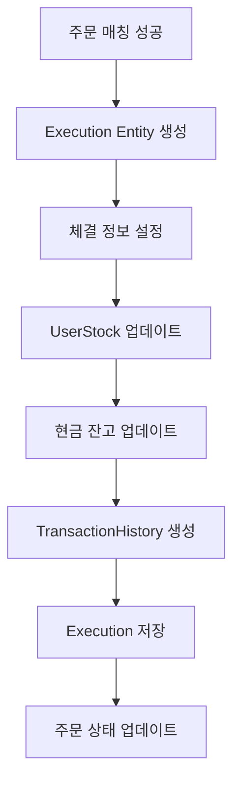
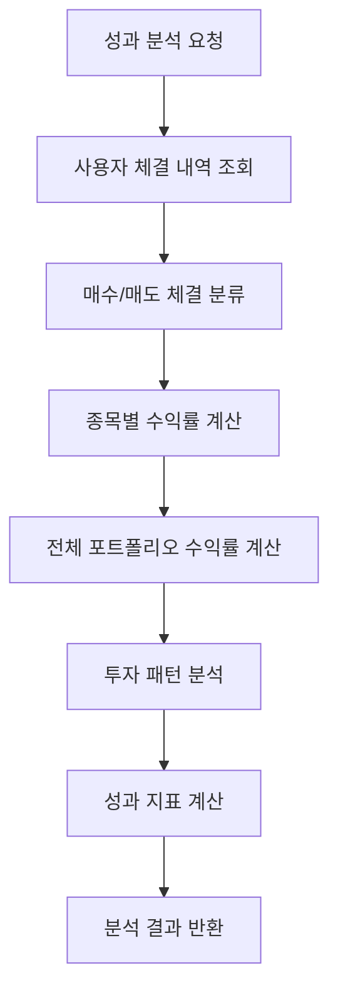

# Execution Domain Documentation

## 📋 개요

Execution 도메인은 주식 거래의 실제 체결 내역을 관리하는 핵심 도메인입니다. 주문이 매칭되어 실제로 체결된 거래의 상세 정보를 기록하고, 이를 통해 투자 성과 분석과 포트폴리오 관리를 지원합니다.

## 🏗️ Entity 구조

### Execution Entity 관계도



<details>
<summary>📄 Entity 코드 보기</summary>

```java
@Entity
@Getter
@NoArgsConstructor(access = lombok.AccessLevel.PROTECTED)
@Builder
@AllArgsConstructor
public class Execution extends BaseEntity {
    @Id
    @GeneratedValue(strategy = GenerationType.IDENTITY)
    private Long id;

    @ManyToOne(fetch = FetchType.LAZY)
    @JoinColumn(name = "user_id")
    private User user;

    @ManyToOne(fetch = FetchType.LAZY)
    @JoinColumn(name = "stock_id")
    private Stock stock;

    @Enumerated(EnumType.STRING)
    @Column(nullable = false, length = 10)
    private OrderType orderType;

    @Column(nullable = false)
    private Long quantity;

    @Column(nullable = false)
    private Long executedPrice;

    @Column(nullable = false)
    private LocalDateTime executedAt;
} 
```

</details>

## 🔧 주요 기능

### 1. 체결 내역 관리

- **체결 기록**: 주문 매칭 시 체결 정보 저장
- **체결 조회**: 사용자별, 종목별 체결 내역 조회
- **체결 통계**: 체결 건수, 거래량, 거래대금 집계

### 2. 투자 성과 분석

- **수익률 계산**: 매수/매도 체결 기반 수익률 분석
- **투자 패턴 분석**: 체결 패턴 및 투자 성향 분석
- **성과 지표**: ROI, Sharpe Ratio 등 계산

### 3. 포트폴리오 관리

- **보유 주식 업데이트**: 체결 시 UserStock 정보 업데이트
- **평단가 계산**: 매수 체결 시 평균 매수가 재계산
- **포트폴리오 가치**: 실시간 포트폴리오 가치 계산

## 📊 비즈니스 플로우

### 체결 처리 플로우



### 투자 성과 분석 플로우



## 🎯 API 엔드포인트

### Swagger UI 스크린샷


**주요 엔드포인트:**

- `GET /api/executions/user/{userId}` - 사용자별 체결 내역 조회
- `GET /api/executions/stock/{stockCode}` - 종목별 체결 내역 조회
- `GET /api/executions/user/{userId}/period` - 기간별 체결 내역 조회
- `GET /api/executions/user/{userId}/performance` - 투자 성과 분석

## 📈 핵심 비즈니스 로직

### 1. 체결 처리 로직

체결이 발생하면 다음과 같은 순서로 처리됩니다:

1. **주문 검증**: 주문 상태가 PENDING인지 확인
2. **잔고 검증**: 매수 시 현금, 매도 시 보유 주식 확인
3. **체결 처리**: 매수/매도에 따른 잔고 업데이트
4. **평단가 계산**: 매수 시 평균 매수가 재계산
5. **거래 내역 생성**: 현금 거래 내역 기록

### 2. 평단가 계산 알고리즘

매수 체결 시 평단가는 다음과 같이 계산됩니다:

```
새 평단가 = (기존 총 매수금액 + 신규 매수금액) / (기존 수량 + 신규 수량)
```

### 3. 투자 성과 분석

종목별 수익률은 매수/매도 체결 내역을 기반으로 계산됩니다:

```
수익률 = ((평균 매도가 - 평균 매수가) / 평균 매수가) × 100
```

<details>
<summary>🔧 핵심 기술 구현</summary>

**트랜잭션 관리**: `@Transactional`을 사용하여 체결-잔고 업데이트-거래내역 생성을 원자적으로 처리

**평단가 계산**: 매수 시마다 실시간으로 평균 매수가를 재계산하여 정확한 수익률 계산

**성과 분석**: Stream API를 활용한 체결 내역 그룹화 및 집계 처리

</details>

## 🔗 연관 도메인

### User (사용자)

- 체결을 발생시킨 사용자
- Execution Entity와 N:1 관계

### Stock (종목)

- 체결된 종목
- Execution Entity와 N:1 관계

### Order (주문)

- 체결의 원인이 된 주문
- Execution Entity와 N:1 관계 (선택적)

### UserStock (보유 주식)

- 체결 시 업데이트되는 보유 주식 정보
- 매수/매도에 따라 수량 및 평단가 변경

### TransactionHistory (거래 내역)

- 체결과 동시에 생성되는 현금 거래 내역
- 매수 시 현금 차감, 매도 시 현금 증가

## 📊 체결 데이터 분석

### 1. 거래량 분석

- **일별 거래량**: 일별 체결 수량 및 거래대금
- **종목별 거래량**: 종목별 인기도 분석
- **시간대별 거래량**: 거래 패턴 분석

### 2. 수익률 분석

- **종목별 수익률**: 개별 종목 투자 성과
- **기간별 수익률**: 투자 기간별 성과 분석
- **포트폴리오 수익률**: 전체 투자 성과

### 3. 투자 패턴 분석

- **매수/매도 패턴**: 투자 성향 분석
- **보유 기간**: 평균 보유 기간 분석
- **거래 빈도**: 활발한 거래 여부

## ✅ 구현 상태

### 핵심 기능 구현 현황

- [x] **체결 내역 관리**: Execution Entity 및 Repository 구현 완료
- [x] **체결 처리 로직**: 매수/매도 체결 처리 구현 완료
- [x] **평단가 계산**: 실시간 평단가 계산 로직 구현 완료
- [x] **투자 성과 분석**: 종목별 수익률 계산 구현 완료
- [x] **API 엔드포인트**: 기본 CRUD API 구현 완료
- [ ] **고급 분석 기능**: 기술적 지표, 리스크 분석 (향후 구현 예정)
- [ ] **실시간 알림**: 체결 발생 시 실시간 알림 (향후 구현 예정)

### 데이터 무결성 검증

- [x] **체결 데이터 검증**: 가격, 수량, 시간 유효성 검사
- [x] **트랜잭션 관리**: 원자적 처리 보장
- [x] **일관성 검증**: 관련 데이터 간 일관성 유지

## 🛡️ 데이터 무결성

### 1. 체결 데이터 검증

- **가격 검증**: 체결가의 유효성 검사
- **수량 검증**: 체결 수량의 유효성 검사
- **시간 검증**: 체결 시간의 일관성 검사

### 2. 트랜잭션 관리

- **원자성**: 체결-잔고 업데이트-거래내역 생성의 원자성
- **일관성**: 관련 데이터 간의 일관성 유지
- **격리성**: 동시 체결 처리 시 격리 수준 보장

## 📈 성능 최적화

### 1. 쿼리 최적화

- **인덱스 활용**: (user_id, executed_at), (stock_code, executed_at) 인덱스
- **페이지네이션**: 대용량 체결 내역 조회 시 페이지네이션
- **집계 쿼리**: 성과 분석을 위한 집계 쿼리 최적화

### 2. 캐싱 전략

- **성과 데이터 캐싱**: 계산된 성과 지표 캐싱
- **통계 데이터 캐싱**: 집계된 통계 데이터 캐싱

<details>
<summary>🚀 확장 가능성</summary>

### 1. 고급 분석 기능

- **기술적 분석**: 이동평균, RSI 등 기술적 지표
- **리스크 분석**: VaR, 최대 손실 분석
- **AI 분석**: 머신러닝 기반 투자 패턴 분석

### 2. 실시간 기능

- **실시간 체결 알림**: 체결 발생 시 실시간 알림
- **실시간 성과 업데이트**: 실시간 수익률 계산
- **실시간 대시보드**: 실시간 투자 현황 대시보드

### 3. 리포트 기능

- **투자 리포트**: 월별/분기별 투자 리포트
- **세금 계산**: 양도소득세 계산 및 신고 지원
- **성과 비교**: 벤치마크 대비 성과 비교
</details>

---

_이 문서는 Motoo 프로젝트의 Execution 도메인 설계를 설명합니다._
