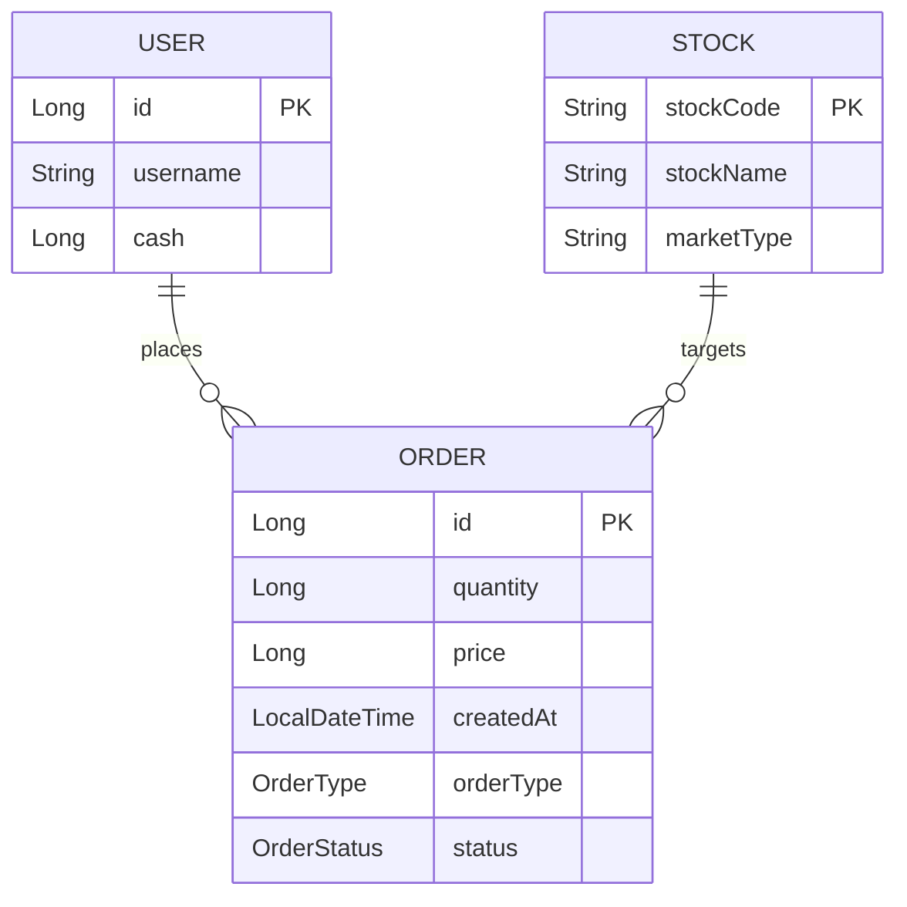
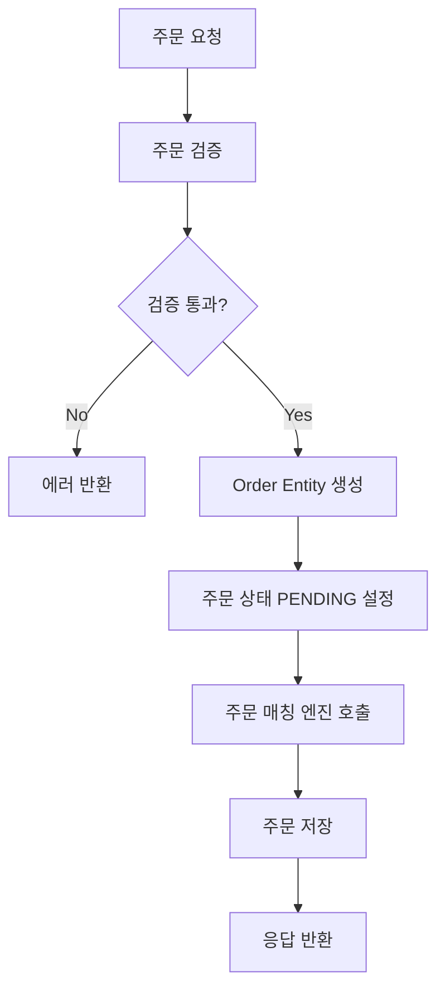
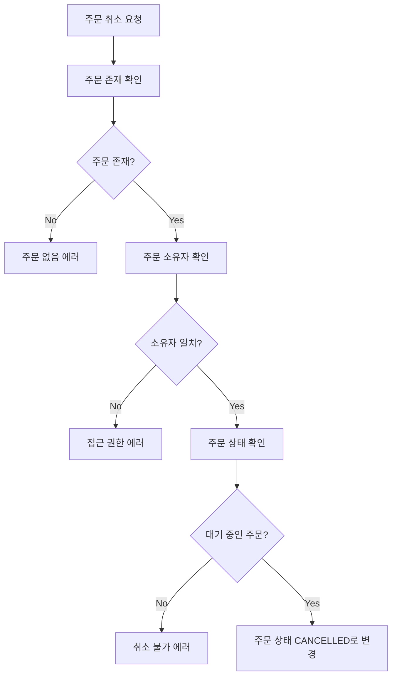
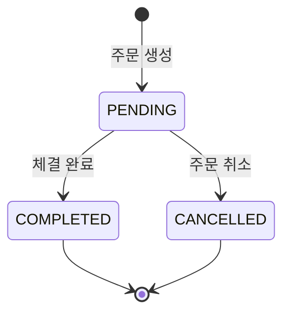

# Order Domain Documentation

## 📋 개요

Order 도메인은 주식 주문 관리, 주문 상태 추적, 주문 매칭 시스템을 담당하는 핵심 도메인입니다. 사용자의 매수/매도 주문을 처리하고 주문 상태를 관리합니다.

## 🏗️ Entity 구조

### Order Entity 관계도



<details>
<summary>📄 Entity 코드 보기</summary>

```java
@Entity
@Table(name = "orders")
@Getter
@NoArgsConstructor(access = lombok.AccessLevel.PROTECTED)
@Builder
@AllArgsConstructor
public class Order extends BaseEntity {
    @Id
    @GeneratedValue(strategy = GenerationType.IDENTITY)
    private Long id;

    @ManyToOne(fetch = FetchType.LAZY)
    @JoinColumn(name = "user_id")
    private User user;

    @ManyToOne(fetch = FetchType.LAZY)
    @JoinColumn(name = "stock_id")
    private Stock stock;

    @Enumerated(EnumType.STRING)
    @Column(nullable = false, length = 10)
    private OrderType orderType; // BUY / SELL

    @Column(nullable = false)
    private Long quantity;

    @Column(nullable = false)
    private Long price; // 지정가

    @Column(nullable = false)
    private LocalDateTime createdAt;

    @Enumerated(EnumType.STRING)
    @Column(nullable = false, length = 15)
    private OrderStatus status; // PENDING / COMPLETED / CANCELLED

    public void updateStatus(OrderStatus status) {
        this.status = status;
    }
} 
```

</details>

## 🔧 주요 기능

### 1. 주문 관리

- **주문 생성**: 매수/매도 주문 생성
- **주문 조회**: 사용자별 주문 내역 조회
- **주문 상태 관리**: PENDING → COMPLETED/CANCELLED
- **주문 취소**: 대기 중인 주문 취소

### 2. 주문 매칭

- **매칭 엔진**: 매수/매도 주문 매칭
- **가격 우선순위**: 동일 가격 시 시간 우선순위
- **부분 체결**: 주문 수량의 일부만 체결 가능
- **잔량 관리**: 미체결 수량 관리

### 3. 주문 검증

- **잔고 검증**: 매수 시 현금 잔고 확인
- **보유 주식 검증**: 매도 시 보유 주식 확인
- **가격 검증**: 지정가 범위 검증
- **수량 검증**: 주문 수량 유효성 검증

## 📊 비즈니스 플로우

### 주문 생성 플로우



### 주문 취소 플로우



## 🎯 API 엔드포인트

### Swagger UI 스크린샷


**주요 엔드포인트:**

- `POST /api/orders` - 주문 생성
- `GET /api/orders` - 사용자별 주문 내역 조회 (페이지네이션 지원)
- `DELETE /api/orders/{orderId}` - 주문 취소

## 📈 핵심 비즈니스 로직

### 1. 주문 생성 로직

주문 생성 시 다음과 같은 검증과 처리가 이루어집니다:

1. **사용자 검증**: 유효한 사용자인지 확인
2. **종목 검증**: 거래 가능한 종목인지 확인
3. **잔고 검증**: 매수 시 충분한 현금, 매도 시 충분한 보유 주식 확인
4. **주문 생성**: 검증 통과 시 Order Entity 생성
5. **매칭 시도**: 즉시 매칭 가능한 주문이 있는지 확인

### 2. 주문 검증 로직

주문 생성 시 다음과 같은 검증이 수행됩니다:

1. **사용자 검증**: 유효한 사용자인지 확인
2. **종목 검증**: 거래 가능한 종목인지 확인
3. **잔고 검증**: 매수 시 충분한 현금, 매도 시 충분한 보유 주식 확인
4. **주문 상태 관리**: PENDING → COMPLETED/CANCELLED 상태 전이

### 3. 주문 상태 관리

주문은 다음과 같은 상태 전이를 거칩니다:

```
PENDING → COMPLETED (체결 완료)
PENDING → CANCELLED (주문 취소)
```

<details>
<summary>🔧 핵심 기술 구현</summary>

**트랜잭션 관리**: `@Transactional`을 사용하여 주문 생성-매칭-체결을 원자적으로 처리

**낙관적 락**: 주문 수량 업데이트 시 버전 관리를 통한 동시성 제어

**매칭 엔진**: 가격-시간 우선순위 기반의 효율적인 주문 매칭 알고리즘

</details>

## 🔗 연관 도메인

### User (사용자)

- 주문을 생성하는 사용자
- Order Entity와 N:1 관계

### Stock (종목)

- 주문 대상 종목
- Order Entity와 N:1 관계

### User (사용자)

- 주문을 생성하는 사용자
- Order Entity와 N:1 관계

### Stock (종목)

- 주문 대상 종목
- Order Entity와 N:1 관계

## 📊 주문 상태 관리

### 상태 전이 다이어그램



### 주문 상태별 처리

- **PENDING**: 매칭 대기 중, 취소 가능
- **COMPLETED**: 체결 완료, 변경 불가
- **CANCELLED**: 취소됨, 재활용 불가

## ✅ 구현 상태

### 핵심 기능 구현 현황

- [x] **주문 관리**: Order Entity 및 Repository 구현 완료
- [x] **주문 생성 로직**: 매수/매도 주문 생성 및 검증 구현 완료
- [x] **주문 상태 관리**: 상태 전이 및 업데이트 로직 구현 완료
- [x] **API 엔드포인트**: 기본 CRUD API 구현 완료
- [x] **페이지네이션**: 주문 내역 조회 시 페이지네이션 지원
- [ ] **주문 매칭 엔진**: 가격-시간 우선순위 매칭 알고리즘 (향후 구현 예정)
- [ ] **고급 주문 타입**: 시장가 주문, 조건부 주문 (향후 구현 예정)
- [ ] **실시간 매칭**: WebSocket 기반 실시간 매칭 (향후 구현 예정)

### 데이터 무결성 검증

- [x] **주문 검증**: 가격, 수량, 잔고 유효성 검사
- [x] **매칭 검증**: 매칭 조건 및 우선순위 검증
- [x] **상태 관리**: 주문 상태 전이 규칙 검증

## 🛡️ 검증 및 에러 처리

### 1. 주문 검증

- **가격 검증**: 지정가 범위 및 유효성 검사
- **수량 검증**: 주문 수량의 유효성 검사
- **잔고 검증**: 매수 시 현금, 매도 시 보유 주식 확인
- **주문 타입 검증**: 매수/매도 타입 유효성 검사

### 2. 잔고 검증

- **매수 주문**: 현금 잔고 >= 주문 금액
- **매도 주문**: 보유 주식 수량 >= 주문 수량
- **수수료 고려**: 매수 시 수수료를 포함한 총 금액 검증

## 📈 성능 최적화

### 1. 주문 조회 최적화

- **페이지네이션**: 대량 주문 데이터의 효율적인 조회
- **인덱스 활용**: (user_id, status, created_at) 복합 인덱스
- **쿼리 최적화**: 사용자별, 상태별 주문 조회 최적화

### 2. 트랜잭션 관리

- **트랜잭션 경계**: 주문 생성 시 원자성 보장
- **동시성 제어**: 주문 취소 시 상태 검증
- **데이터 무결성**: 주문 상태 변경 시 유효성 검증

<details>
<summary>🚀 확장 가능성</summary>

### 1. 주문 타입 확장

- **시장가 주문**: 현재 시장가로 즉시 체결
- **조건부 주문**: 특정 조건 만족 시 주문 실행
- **기한부 주문**: 지정 기한까지 유효한 주문

### 2. 주문 매칭 시스템

- **매칭 엔진**: 가격-시간 우선순위 기반 매칭
- **부분 체결**: 주문 수량의 일부만 체결
- **실시간 매칭**: WebSocket 기반 실시간 매칭

### 3. 모니터링 및 알림

- **주문 상태 알림**: 체결/취소 시 실시간 알림
- **주문 모니터링**: 주문 처리 현황 대시보드
- **성과 분석**: 주문 처리 성능 분석
</details>

---

_이 문서는 Motoo 프로젝트의 Order 도메인 설계를 설명합니다._
