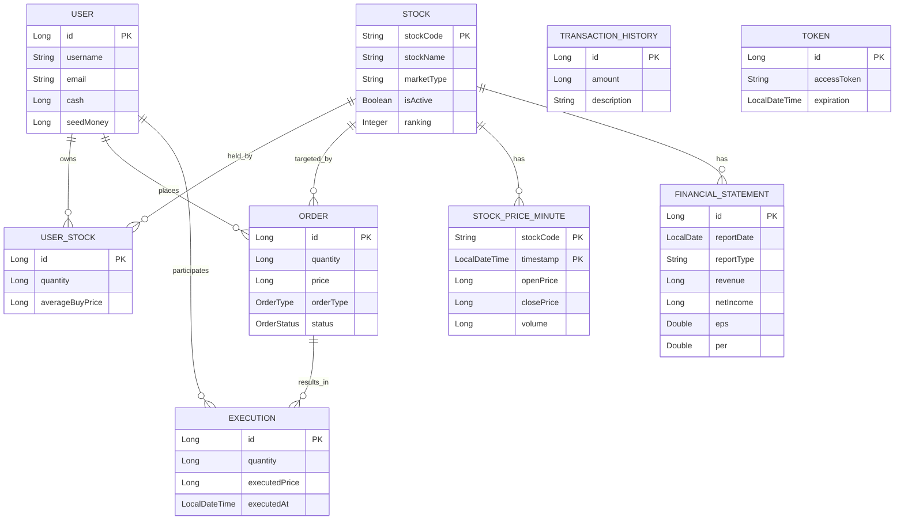
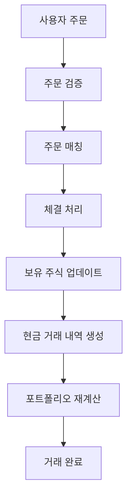
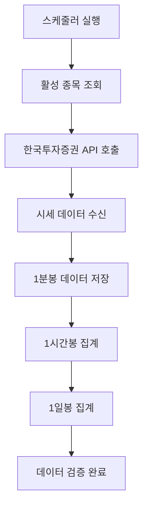
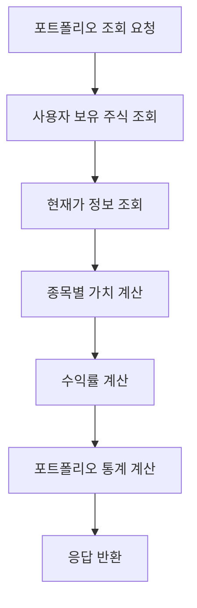

# Motoo Domain Overview

## 📋 프로젝트 개요

Motoo는 한국투자증권 API를 활용한 주식 투자 플랫폼으로, 실시간 주식 시세 수집, 주문 매칭, 포트폴리오 관리, 그리고 투자 성과 분석을 제공하는 종합적인 투자 시스템입니다.

## 🏗️ 전체 시스템 아키텍처

### 도메인 간 관계도



## 🔧 핵심 도메인 기능

### 1. User Domain (사용자 관리)

- **사용자 계정 관리**: 회원가입, 로그인, 프로필 관리
- **현금 관리**: 현금 잔고 추적 및 관리
- **보안 관리**: JWT 토큰 기반 인증 및 권한 관리

### 2. Stock Domain (주식 관리)

- **종목 관리**: KOSPI 200, NASDAQ 상위 종목 관리
- **시세 데이터 수집**: 1분봉, 1시간봉, 1일봉 데이터 수집
- **재무제표 관리**: 분기별/연간 재무제표 데이터 관리
- **한국투자증권 API 연동**: 실시간 시세 및 종목 정보 수집

### 3. Order Domain (주문 관리)

- **주문 생성**: 매수/매도 주문 생성 및 검증
- **주문 매칭**: 가격-시간 우선순위 기반 주문 매칭
- **주문 상태 관리**: PENDING → COMPLETED/CANCELLED 상태 전이
- **주문 취소**: 대기 중인 주문 취소 기능

### 4. Execution Domain (체결 관리)

- **체결 처리**: 주문 매칭 시 체결 내역 생성
- **체결 검증**: 체결 금액 및 수량 검증
- **체결 이력**: 사용자별 체결 내역 관리

### 5. Transaction Domain (거래 내역)

- **현금 거래 추적**: 매수/매도 시 현금 흐름 관리
- **거래 내역 관리**: 사용자별 거래 이력 조회
- **거래 통계**: 거래 패턴 및 성과 분석

### 6. Portfolio Domain (포트폴리오)

- **보유 주식 관리**: 사용자별 보유 주식 정보 관리
- **포트폴리오 분석**: 실시간 포트폴리오 가치 및 수익률 계산
- **투자 성과 분석**: 종목별, 전체 포트폴리오 성과 분석

### 7. Token Domain (토큰 관리)

- **API 토큰 관리**: 한국투자증권 API 접근 토큰 관리
- **토큰 갱신**: 자동/수동 토큰 갱신 기능
- **토큰 검증**: 토큰 유효성 및 만료 시간 검증

## 📊 시스템 데이터 플로우

### 주식 거래 플로우



### 시세 데이터 수집 플로우



### 포트폴리오 조회 플로우



## 🎯 핵심 비즈니스 로직

### 1. 주문 검증 시스템

- **사용자 검증**: 유효한 사용자인지 확인
- **잔고 검증**: 매수 시 충분한 현금, 매도 시 충분한 보유 주식 확인
- **주문 상태 관리**: PENDING → COMPLETED/CANCELLED 상태 전이

### 2. 포트폴리오 가치 계산

- **현재 가치**: 보유 주식 × 현재가 + 현금 잔고
- **수익률 계산**: (현재 가치 - 초기 투자금) / 초기 투자금 × 100
- **평단가 관리**: 매수 시마다 평균 매수가 재계산

### 3. 실시간 데이터 처리

- **시세 수집**: 1분마다 활성 종목 시세 수집
- **데이터 집계**: 하위 단위 데이터를 상위 단위로 집계
- **데이터 검증**: 수집된 데이터의 유효성 검사

## 🔗 도메인 간 상호작용

### 1. 주문-체결 연계

```
Order → Execution
  ↓         ↓
UserStock ← User
```

### 2. 시세-포트폴리오 연계

```
StockPrice → Stock → UserStock → Portfolio
     ↓         ↓         ↓          ↓
  PriceUtil ← StockApi ← User ← PortfolioService
```

### 3. 토큰-API 연계

```
Token → StockApiService → Stock
  ↓           ↓            ↓
TokenService → KisConfig → StockManagement
```

## 📅 스케줄링 시스템

### 1. 데이터 수집 스케줄

- **1분봉 수집**: 평일 09:00-15:30, 매 1분마다
- **1시간봉 집계**: 매 시간 정각
- **1일봉 집계**: 매일 자정
- **종목 갱신**: 매월 1일 자정
- **재무제표 수집**: 분기별/연간

### 2. 시스템 관리 스케줄

- **토큰 갱신**: 토큰 만료 1시간 전 자동 갱신
- **데이터 정리**: 만료된 데이터 주기적 정리
- **시스템 모니터링**: 시스템 상태 주기적 확인

## ✅ 구현 상태

### 핵심 기능 구현 현황

- [x] **사용자 관리**: 사용자 프로필 조회, 자산 계산
- [x] **주식 관리**: 종목 정보, 시세 데이터 수집, 재무제표 관리
- [x] **주문 시스템**: 주문 생성, 검증, 상태 관리
- [x] **포트폴리오**: 보유 주식 관리, 실시간 가치 계산
- [x] **거래 내역**: 거래 내역 조회 및 필터링
- [x] **API 연동**: 한국투자증권 API 토큰 관리
- [x] **스케줄링**: 정기적 데이터 수집 및 관리
- [ ] **주문 매칭**: 가격-시간 우선순위 기반 주문 매칭
- [ ] **실시간 기능**: WebSocket 기반 실시간 업데이트
- [ ] **고급 분석**: AI 기반 투자 분석 및 예측

### 시스템 통합 상태

- [x] **도메인 연동**: 모든 도메인 간 데이터 연동
- [x] **API 통합**: RESTful API 엔드포인트 통합
- [x] **데이터 무결성**: 트랜잭션 관리 및 검증
- [x] **에러 처리**: 통합된 예외 처리 및 로깅
- [ ] **모니터링**: 시스템 성능 및 상태 모니터링
- [ ] **알림 시스템**: 실시간 알림 및 경고

## 🛡️ 시스템 보안 및 안정성

### 1. 데이터 보안

- **비밀번호 암호화**: BCrypt 기반 안전한 비밀번호 저장
- **JWT 토큰**: 안전한 사용자 인증 토큰 관리
- **API 보안**: 한국투자증권 API 토큰 보안 관리

### 2. 데이터 무결성

- **트랜잭션 관리**: ACID 속성 보장
- **참조 무결성**: 외래키 제약조건을 통한 데이터 일관성
- **검증 로직**: 비즈니스 룰 기반 데이터 검증

### 3. 시스템 안정성

- **에러 처리**: 포괄적인 예외 처리 및 복구
- **로깅**: 상세한 시스템 로그 및 모니터링
- **백업**: 정기적인 데이터 백업 및 복구

## 📈 성능 최적화

### 1. 데이터베이스 최적화

- **인덱스 전략**: 효율적인 쿼리를 위한 인덱스 설계
- **쿼리 최적화**: N+1 문제 해결 및 Fetch Join 활용
- **캐싱**: Redis를 통한 자주 조회되는 데이터 캐싱

### 2. API 성능

- **페이지네이션**: 대용량 데이터 조회 시 페이지네이션
- **배치 처리**: 대량 데이터 처리 시 배치 단위 처리
- **비동기 처리**: 시간이 오래 걸리는 작업의 비동기 처리

<details>
<summary>🚀 확장 가능성</summary>

### 1. 기능 확장

- **실시간 거래**: WebSocket 기반 실시간 주문 및 체결
- **모바일 앱**: React Native 기반 모바일 애플리케이션
- **웹 대시보드**: React 기반 실시간 대시보드

### 2. 분석 기능

- **AI 분석**: 머신러닝 기반 투자 패턴 분석
- **예측 모델**: 주가 예측 및 투자 추천 시스템
- **리스크 관리**: VaR, 스트레스 테스트 등 리스크 분석

### 3. 서비스 확장

- **다중 시장**: 해외 주식, 채권, ETF 등 추가 시장
- **소셜 기능**: 투자 성과 공유 및 커뮤니티
- **교육 플랫폼**: 투자 교육 및 시뮬레이션

### 4. 기술 확장

- **마이크로서비스**: 도메인별 마이크로서비스 아키텍처
- **클라우드 배포**: AWS/Azure 기반 클라우드 인프라
- **DevOps**: CI/CD 파이프라인 및 자동화
</details>

---

_이 문서는 Motoo 프로젝트의 전체 도메인 아키텍처와 시스템 개요를 설명합니다._
