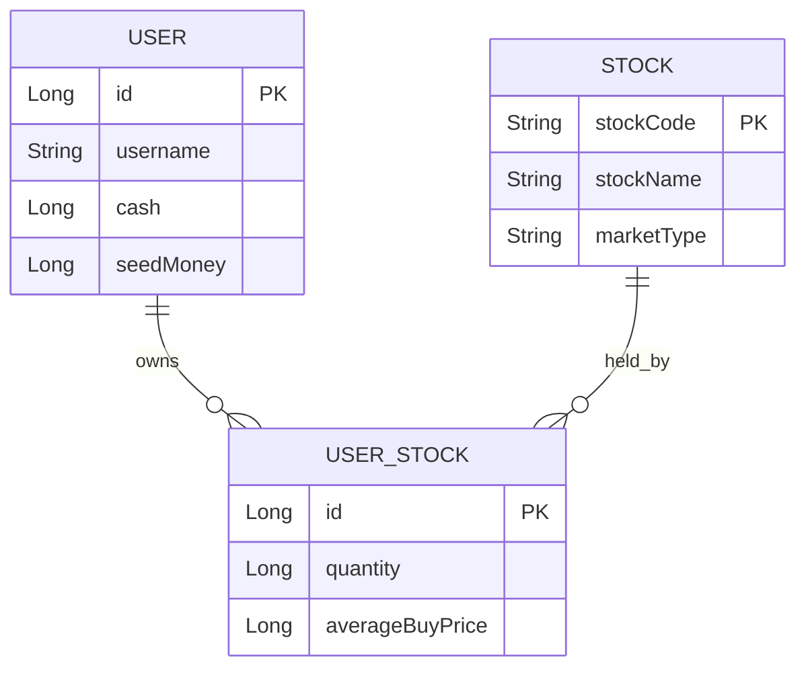
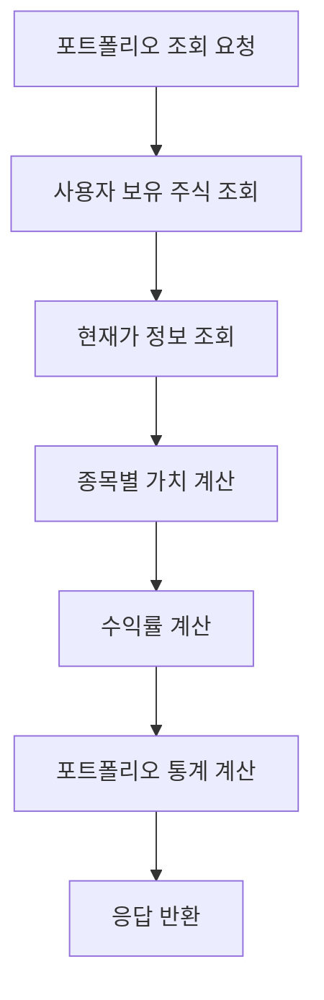
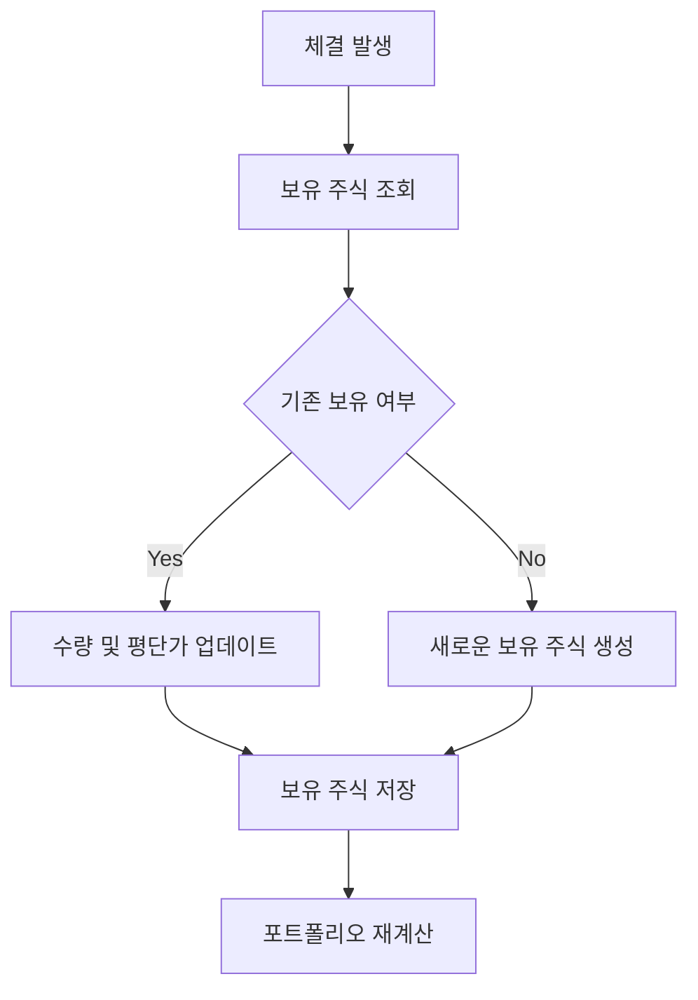

# Portfolio Domain Documentation

## 📋 개요

Portfolio 도메인은 사용자의 보유 주식 관리와 포트폴리오 분석을 담당하는 핵심 도메인입니다. 사용자가 보유한 주식 정보, 포트폴리오 가치 계산, 수익률 분석, 그리고 포트폴리오 최적화를 지원합니다.

## 🏗️ Entity 구조

### Portfolio Entity 관계도



<details>
<summary>📄 Entity 코드 보기</summary>

```java
@Entity
@Getter
@NoArgsConstructor(access = lombok.AccessLevel.PROTECTED)
@Builder
@AllArgsConstructor
public class UserStock extends BaseEntity {
    @Id
    @GeneratedValue(strategy = GenerationType.IDENTITY)
    private Long id;

    @ManyToOne(fetch = FetchType.LAZY)
    @JoinColumn(name = "user_id")
    private User user;

    @ManyToOne(fetch = FetchType.LAZY)
    @JoinColumn(name = "stock_id")
    private Stock stock;

    @Column(nullable = false)
    private Long quantity;

    @Column(nullable = false)
    private Long averageBuyPrice; // 평단가

    public void updateQuantity(Long quantity) {
        this.quantity = quantity;
    }

    public void updateAverageBuyPrice(Long averageBuyPrice) {
        this.averageBuyPrice = averageBuyPrice;
    }
} 
```

</details>

## 🔧 주요 기능

### 1. 보유 주식 관리

- **보유 주식 조회**: 사용자별 보유 주식 목록 조회
- **보유 주식 업데이트**: 매수/매도 시 보유 주식 정보 업데이트
- **평단가 계산**: 매수 시 평균 매수가 자동 계산
- **보유 기간 관리**: 주식 보유 기간 추적

### 2. 포트폴리오 분석

- **포트폴리오 가치 계산**: 실시간 포트폴리오 총 가치
- **수익률 분석**: 종목별, 전체 포트폴리오 수익률
- **분산도 분석**: 포트폴리오 분산 및 리스크 분석
- **성과 지표**: ROI, Sharpe Ratio 등 계산

### 3. 포트폴리오 최적화

- **자산 배분 분석**: 종목별 자산 배분 현황
- **리밸런싱 제안**: 최적 자산 배분 제안
- **리스크 관리**: 포트폴리오 리스크 평가

## 📊 비즈니스 플로우

### 포트폴리오 조회 플로우



### 보유 주식 업데이트 플로우



## 🎯 API 엔드포인트

### Swagger UI 스크린샷


**주요 엔드포인트:**

- `GET /api/portfolio` - 포트폴리오 조회 (페이지네이션 지원)

## 📈 핵심 비즈니스 로직

### 1. 포트폴리오 조회 로직

포트폴리오 조회 시 다음과 같은 계산이 이루어집니다:

1. **보유 주식 조회**: 사용자의 모든 보유 주식 정보 조회
2. **현재가 조회**: 각 종목의 실시간 현재가 조회
3. **종목별 계산**: 각 종목의 현재 가치, 손익, 수익률 계산
4. **포트폴리오 집계**: 전체 포트폴리오 통계 계산
5. **응답 구성**: 포트폴리오 정보와 종목별 상세 정보 반환

### 2. 포트폴리오 가치 계산

포트폴리오 가치는 다음과 같이 계산됩니다:

```
총 주식 가치 = Σ(종목별 현재가 × 보유수량)
총 자산 가치 = 현금 + 총 주식 가치
순손익 = 총 자산 가치 - 초기 투자금
```

### 3. 수익률 계산

수익률은 다음과 같이 계산됩니다:

- **종목별 수익률**: (현재가 - 평단가) / 평단가 × 100
- **실시간 가격 조회**: PriceUtil을 통한 한국투자증권 API 연동
- **정확한 계산**: 소수점 2자리까지 정확한 수익률 계산

<details>
<summary>🔧 핵심 기술 구현</summary>

**실시간 가격 조회**: PriceUtil을 통한 한국투자증권 API 연동으로 실시간 현재가 조회

**포트폴리오 집계**: Stream API를 활용한 보유 주식 그룹화 및 집계 처리

**Builder 패턴**: DTO 생성 시 setter 대신 Builder 패턴 사용으로 불변성 보장

**페이지네이션**: 대량 포트폴리오 데이터의 효율적인 조회

</details>

## 🔗 연관 도메인

### User (사용자)

- 포트폴리오 소유자
- UserStock Entity와 N:1 관계

### Stock (종목)

- 보유 주식 정보
- UserStock Entity와 N:1 관계

### User (사용자)

- 포트폴리오 소유자
- UserStock Entity와 N:1 관계

### Stock (종목)

- 보유 주식 정보
- UserStock Entity와 N:1 관계

## 📊 포트폴리오 분석 지표

### 1. 수익률 지표

- **개별 종목 수익률**: (현재가 - 평단가) / 평단가 × 100
- **포트폴리오 수익률**: 전체 포트폴리오 수익률
- **가중 평균 수익률**: 종목별 가중 평균 수익률

### 2. 리스크 지표

- **변동성**: 포트폴리오 가치 변동성
- **베타**: 시장 대비 변동성
- **최대 손실**: 최대 손실 가능 금액
- **VaR (Value at Risk)**: 위험 가치

### 3. 성과 지표

- **ROI (Return on Investment)**: 투자 수익률
- **Sharpe Ratio**: 위험 조정 수익률
- **Sortino Ratio**: 하방 위험 조정 수익률
- **Calmar Ratio**: 최대 손실 대비 수익률

## ✅ 구현 상태

### 핵심 기능 구현 현황

- [x] **보유 주식 관리**: UserStock Entity 및 Repository 구현 완료
- [x] **포트폴리오 조회**: 실시간 포트폴리오 가치 계산 구현 완료
- [x] **수익률 분석**: 종목별, 포트폴리오 수익률 계산 구현 완료
- [x] **API 엔드포인트**: 기본 포트폴리오 API 구현 완료
- [x] **페이지네이션**: 보유 주식 조회 시 페이지네이션 지원
- [ ] **평단가 계산**: 매수 시 평단가 자동 계산 로직 (향후 구현 예정)
- [ ] **고급 분석 기능**: 리스크 분석, 성과 지표 (향후 구현 예정)
- [ ] **포트폴리오 최적화**: 자동 리밸런싱 제안 (향후 구현 예정)

### 데이터 무결성 검증

- [x] **보유 주식 데이터 검증**: 수량, 평단가 유효성 검사
- [x] **포트폴리오 계산 검증**: 가치 계산의 정확성 검증
- [x] **실시간 업데이트**: 체결 시 실시간 포트폴리오 업데이트

## 🛡️ 데이터 무결성

### 1. 보유 주식 데이터 검증

- **수량 검증**: 보유 수량의 유효성 검사
- **평단가 검증**: 평균 매수가의 유효성 검사
- **일관성 검증**: 체결 내역과 보유 주식의 일치성

### 2. 포트폴리오 계산 검증

- **가치 계산 검증**: 포트폴리오 가치 계산의 정확성
- **수익률 계산 검증**: 수익률 계산의 정확성
- **실시간 업데이트**: 체결 시 실시간 포트폴리오 업데이트

## 📈 성능 최적화

### 1. 쿼리 최적화

- **인덱스 활용**: (user_id, stock_id) 복합 인덱스
- **Fetch Join**: 연관 엔티티 조회 최적화
- **캐싱**: 자주 조회되는 포트폴리오 정보 캐싱

### 2. 계산 최적화

- **배치 계산**: 대량 포트폴리오 계산 시 배치 처리
- **캐싱**: 계산된 분석 결과 캐싱
- **비동기 처리**: 실시간 가격 업데이트 비동기 처리

<details>
<summary>🚀 확장 가능성</summary>

### 1. 고급 분석 기능

- **기술적 분석**: 이동평균, RSI 등 기술적 지표
- **기본적 분석**: 재무제표 기반 밸류에이션
- **AI 분석**: 머신러닝 기반 포트폴리오 최적화

### 2. 포트폴리오 최적화

- **자동 리밸런싱**: 목표 자산 배분 자동 조정
- **리스크 관리**: 자동 리스크 조정
- **성과 모니터링**: 실시간 성과 모니터링

### 3. 알림 기능

- **수익률 알림**: 목표 수익률 달성 시 알림
- **손실 알림**: 손실 한도 도달 시 알림
- **리밸런싱 알림**: 자산 배분 불균형 시 알림

### 4. 리포트 기능

- **포트폴리오 리포트**: 월별/분기별 포트폴리오 리포트
- **성과 분석 리포트**: 투자 성과 상세 분석
- **리밸런싱 리포트**: 포트폴리오 최적화 제안
</details>

---

_이 문서는 Motoo 프로젝트의 Portfolio 도메인 설계를 설명합니다._
