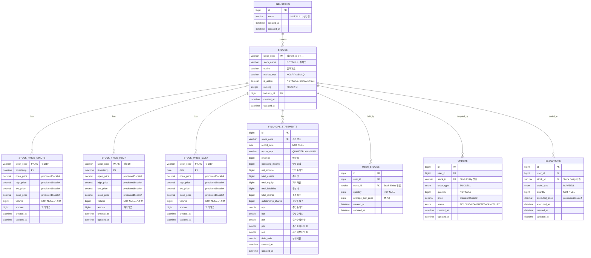
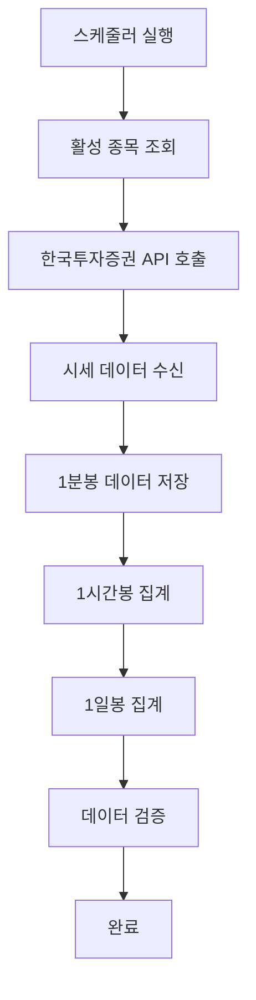
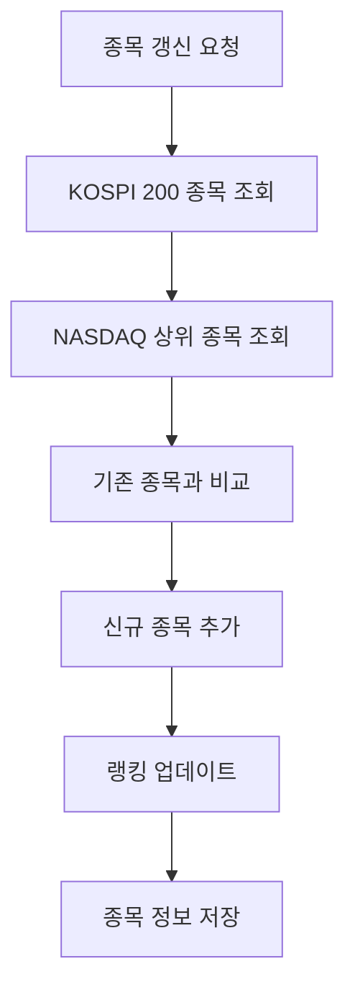

# Stock Domain Documentation

## 📋 개요

Stock 도메인은 주식 종목 정보 관리, 시세 데이터 수집, 재무제표 데이터 관리, 그리고 한국투자증권 API 연동을 담당하는 핵심 도메인입니다.

## 🏗️ Entity 구조

### Stock Entity 관계도



<details>
<summary>📄 Entity 코드 보기</summary>

```java
@Entity
@Table(name = "stocks")
@Getter
@NoArgsConstructor(access = lombok.AccessLevel.PROTECTED)
public class Stock extends BaseEntity {
    @Id
    @Column(name = "stock_code", length = 10)
    private String stockCode; // 종목 코드 (ex. 005930)

    @Column(name = "stock_name", nullable = false, length = 50)
    private String stockName;

    @Column(length = 255)
    private String outline;

    @Column(name = "market_type", length = 20)
    private String marketType; // KOSPI, NASDAQ 등

    @Column(name = "is_active", nullable = false)
    private Boolean isActive = true; // 데이터 수집 활성화 여부

    @Column(name = "ranking")
    private Integer ranking; // 시장 내 순위

    // 연관관계
    @ManyToOne(fetch = FetchType.LAZY)
    @JoinColumn(name = "industry_id")
    private Industry industry;

    @Builder
    public Stock(String stockCode, String stockName, String outline,
                 String marketType, Industry industry, Integer ranking) {
        this.stockCode = stockCode;
        this.stockName = stockName;
        this.outline = outline;
        this.marketType = marketType;
        this.industry = industry;
        this.ranking = ranking;
        this.isActive = true;
    }

    public void updateStockInfo(String stockName, String outline, String marketType, Industry industry, Integer ranking) {
        this.stockName = stockName;
        this.outline = outline;
        this.marketType = marketType;
        this.industry = industry;
        this.ranking = ranking;
    }

    public void updateRanking(Integer ranking) {
        this.ranking = ranking;
    }

    public void setActive(Boolean isActive) {
        this.isActive = isActive;
    }
}
```

</details>

## 🔧 주요 기능

### 1. 종목 관리

- **종목 등록/수정**: 새로운 종목 추가 및 정보 업데이트
- **종목 활성화 관리**: 데이터 수집 대상 종목 설정
- **종목 검색**: 종목명, 종목코드로 검색
- **시장별 분류**: KOSPI, NASDAQ 등 시장별 분류

### 2. 시세 데이터 수집

- **실시간 시세 수집**: 한국투자증권 API를 통한 실시간 데이터
- **시계열 데이터 저장**: 1분봉, 1시간봉, 1일봉 데이터
- **자동 데이터 수집**: 스케줄러를 통한 정기적 수집
- **데이터 집계**: 하위 단위 데이터를 상위 단위로 집계

### 3. 재무제표 관리

- **재무제표 수집**: 분기별/연간 재무제표 데이터
- **재무지표 계산**: EPS, BPS, PER, PBR, ROE 등
- **재무제표 조회**: 종목별, 기간별 재무제표 조회

### 4. 한국투자증권 API 연동

- **토큰 관리**: API 접근 토큰 발급 및 갱신
- **API 호출**: 종목 정보, 시세 데이터, 재무제표 조회
- **에러 처리**: API 호출 실패 시 재시도 및 fallback

## 📊 비즈니스 플로우

### 시세 데이터 수집 플로우



### 종목 갱신 플로우



## 🎯 API 엔드포인트

### Swagger UI 스크린샷


**주요 엔드포인트:**

- `GET /api/v1/stocks` - 주식 목록 조회 (페이지네이션 지원, 실시간 가격 포함)
- `GET /api/v1/stocks/{stockCode}` - 종목 상세 정보 (현재가, 수익률 포함)
- `POST /api/v1/stocks/search` - 종목 검색 (키워드, 시장타입, 산업별)

### Stock Management API


**관리 엔드포인트:**

- `POST /api/v1/stock-management/stocks/kospi200` - KOSPI 200 종목 갱신
- `POST /api/v1/stock-management/stocks/nasdaq` - NASDAQ 상위 종목 갱신
- `GET /api/v1/stock-management/stocks/active` - 활성화된 종목 조회
- `PUT /api/v1/stock-management/stocks/{stockCode}/active` - 종목 활성화 상태 변경
- `POST /api/v1/stock-management/data/collect/minute` - 1분봉 데이터 수집
- `POST /api/v1/stock-management/data/aggregate/hour` - 1시간봉 데이터 집계
- `POST /api/v1/stock-management/data/aggregate/daily` - 1일봉 데이터 집계
- `POST /api/v1/stock-management/data/collect/financial` - 재무제표 데이터 수집
- `POST /api/v1/stock-management/test/e2e` - E2E 테스트

### WebSocket API

**실시간 데이터 엔드포인트:**

- `GET /api/v1/websocket/status` - WebSocket 연결 상태 조회
- `POST /api/v1/websocket/subscribe/{stockCode}` - 특정 종목 실시간 데이터 구독

## 📈 핵심 비즈니스 로직

### 1. 실시간 주식 데이터 조회 로직

StockController에서 구현된 실시간 데이터 조회:

```java
// 주식 목록 조회 시 실시간 가격 포함
List<StockResponse> stockResponses = stocks.stream()
    .map(stock -> {
        StockResponse stockResponse = stockMapper.toStockResponse(stock);
        
        // PriceUtil을 통한 실시간 현재가 조회
        BigDecimal currentPrice = priceUtil.getCurrentPrice(stock.getStockCode());
        BigDecimal changeRate = priceUtil.getChangeRate(stock.getStockCode());
        
        // Builder 패턴으로 응답 구성
        return StockResponse.builder()
            .stockCode(stockResponse.getStockCode())
            .stockName(stockResponse.getStockName())
            .currentPrice(currentPrice)
            .changeRate(changeRate)
            .build();
    })
    .collect(Collectors.toList());
```

### 2. 시세 데이터 수집 및 저장 로직

StockDataCollectionService의 핵심 로직:

1. **활성 종목 조회**: `stockRepository.findActiveStocksByMarketType()`
2. **스케줄링 실행**: 평일 거래시간 중 매분 실행
3. **API 호출**: 한국투자증권 API를 통한 분봉 데이터 수집
4. **BigDecimal 저장**: 정밀도 보장을 위한 DECIMAL(15,4) 타입 사용
5. **데이터 집계**: 분봉 → 시간봉 → 일봉 자동 집계
6. **에러 처리**: API 제한 시 Thread.sleep() 및 재시도

### 3. 종목 검색 및 필터링

종목 검색 시스템의 고급 기능:

- **키워드 검색**: 종목명, 종목코드 기반 검색
- **시장별 필터링**: KOSPI/NASDAQ 시장 구분
- **산업별 필터링**: Industry Entity와 연동
- **페이지네이션**: 대량 데이터 효율적 조회
- **실시간 가격 연동**: 검색 결과에 현재가 정보 포함

### 4. BigDecimal 기반 정밀 계산

금융 데이터의 정확성을 위한 BigDecimal 활용:

- **주가 데이터**: DECIMAL(15,4) 타입으로 소수점 4자리 정밀도
- **수익률 계산**: 부동소수점 오차 방지
- **해외 주식 지원**: NASDAQ 등 달러 기반 소수점 가격 지원
- **API 호환성**: 한국투자증권 API 응답 데이터와 완벽 호환

<details>
<summary>🔧 핵심 기술 구현</summary>

**스케줄링**: `@Scheduled` 어노테이션을 사용한 정기적 데이터 수집

**API 연동**: RestTemplate을 통한 한국투자증권 API 호출 및 토큰 관리

**데이터 집계**: Stream API를 활용한 시계열 데이터 집계 처리

**복합키 관리**: 시계열 데이터의 복합키를 통한 중복 방지 및 효율적 조회

</details>

## 🔗 연관 도메인

### Industry (산업)

- 주식 종목의 산업 분류
- Stock Entity와 1:N 관계

### FinancialStatement (재무제표)

- 종목별 재무제표 정보
- Stock Entity와 1:N 관계

### StockPriceMinute/Hour/Daily (시세 데이터)

- 종목별 시계열 가격 데이터
- Stock Entity와 1:N 관계

## 📅 스케줄링

### 1. 시세 데이터 수집 스케줄

- **1분봉 수집**: 평일 09:00-15:30, 매 1분마다
- **1시간봉 집계**: 매 시간 정각
- **1일봉 집계**: 매일 자정

### 2. 종목 갱신 스케줄

- **종목 갱신**: 매월 1일 자정

### 3. 재무제표 수집 스케줄

- **분기별 재무제표**: 분기 종료 후 1개월
- **연간 재무제표**: 연도 종료 후 3개월

## ✅ 구현 상태

### 핵심 기능 구현 현황

- [x] **Stock Entity**: 완전한 Entity 구조 및 연관관계 구현 완료
- [x] **시세 데이터 수집**: BigDecimal 기반 고정밀 1분봉/시간봉/일봉 수집 완료
- [x] **실시간 API 연동**: StockController에서 PriceUtil 통한 실시간 가격 조회
- [x] **스케줄링 시스템**: StockSchedulerService/StockDataCollectionService 완료
- [x] **종목 관리 시스템**: KOSPI200/NASDAQ 종목 자동 갱신 및 활성화 관리
- [x] **검색 기능**: 키워드, 시장타입, 산업별 고급 검색 기능 완료
- [x] **페이지네이션**: 대량 데이터 효율적 조회 지원
- [x] **API 엔드포인트**: `/api/v1/stocks/*` 완전 구현
- [x] **데이터 정밀도**: BigDecimal(15,4) 기반 금융 데이터 정확성 보장
- [x] **WebSocket 준비**: 실시간 데이터 구독 API 구현 (연결 이슈 해결 필요)
- [x] **재무제표 Entity**: FinancialStatement 구조 완료
- [ ] **재무제표 수집**: 분기별/연간 재무데이터 자동 수집 (향후 구현 예정)
- [ ] **기술적 지표**: 이동평균, RSI, MACD 등 (향후 구현 예정)
- [ ] **WebSocket 안정화**: 실시간 시세 스트리밍 (연결 문제 해결 후)

### 데이터 무결성 및 성능

- [x] **Entity 제약조건**: NOT NULL, 복합키(stock_code + timestamp) 적용
- [x] **BigDecimal 정밀도**: 부동소수점 오차 방지, 금융 계산 정확성
- [x] **API 에러 처리**: BaseException, 사용자 정의 ErrorCode 적용  
- [x] **트랜잭션 관리**: @Transactional 적용, 데이터 일관성 보장
- [x] **성능 최적화**: 페이지네이션, Stream API, Builder 패턴 활용
- [x] **스케줄링 최적화**: ThreadPoolTaskScheduler 활용, API 호출 제한 고려

## 🛡️ 에러 처리

### 1. API 호출 에러 처리

- **토큰 갱신**: API 호출 실패 시 자동 토큰 갱신
- **재시도 로직**: 일시적 오류 시 재시도
- **Fallback 처리**: API 실패 시 캐시된 데이터 사용

### 2. 데이터 검증

- **중복 데이터 방지**: 복합키를 통한 중복 방지
- **데이터 무결성**: Foreign Key 제약조건
- **비즈니스 룰 검증**: 가격, 거래량 등 유효성 검사

## 📊 성능 최적화

### 1. 데이터베이스 최적화

- **복합키 인덱스**: (stock_code, timestamp) 인덱스
- **파티셔닝**: 시계열 데이터 날짜별 파티셔닝
- **아카이빙**: 오래된 데이터 아카이빙

### 2. 캐싱 전략

- **현재가 캐싱**: Redis를 통한 실시간 가격 캐싱
- **종목 정보 캐싱**: 자주 조회되는 종목 정보 캐싱
- **재무지표 캐싱**: 계산된 재무지표 캐싱

<details>
<summary>🚀 확장 가능성</summary>

### 1. 추가 시장 지원

- **해외 주식**: NYSE, LSE 등 추가 시장
- **ETF/ETN**: 상장지수펀드, 상장지수증권
- **채권**: 국채, 회사채 등

### 2. 고급 분석 기능

- **기술적 분석**: 이동평균, RSI, MACD 등
- **기본적 분석**: 재무제표 분석, 밸류에이션
- **AI 분석**: 머신러닝 기반 가격 예측

### 3. 실시간 기능

- **실시간 시세**: WebSocket 기반 실시간 가격 업데이트
- **실시간 알림**: 가격 변동 시 실시간 알림
- **실시간 대시보드**: 실시간 시장 현황 대시보드
</details>

---

_이 문서는 Motoo 프로젝트의 Stock 도메인 설계를 설명합니다._
