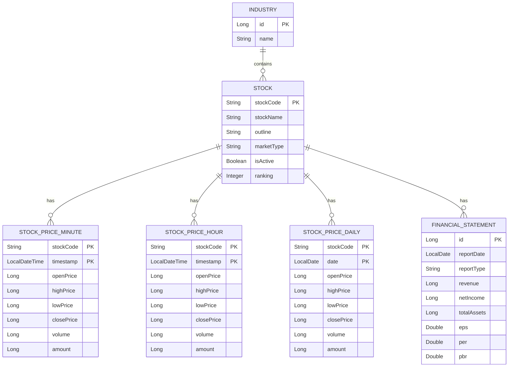
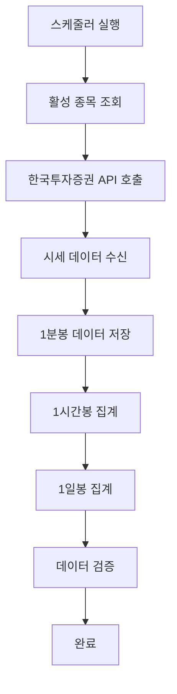
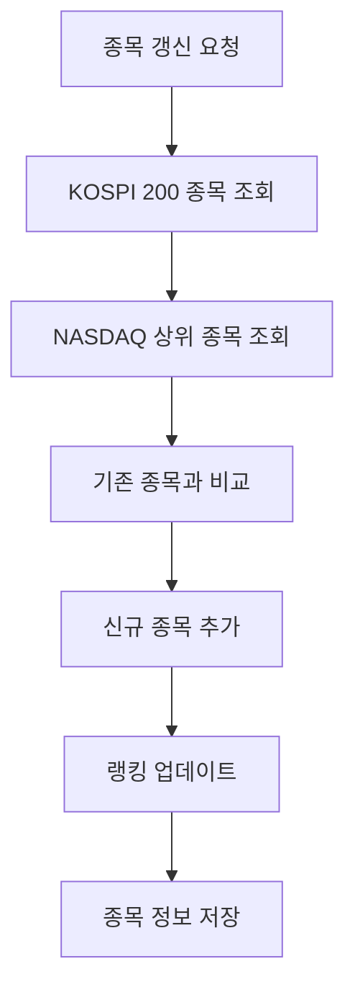

# Stock Domain Documentation

## 📋 개요

Stock 도메인은 주식 종목 정보 관리, 시세 데이터 수집, 재무제표 데이터 관리, 그리고 한국투자증권 API 연동을 담당하는 핵심 도메인입니다.

## 🏗️ Entity 구조

### Stock Entity 관계도



<details>
<summary>📄 Entity 코드 보기</summary>

```java
@Entity
@Table(name = "stocks")
@Getter
@NoArgsConstructor(access = lombok.AccessLevel.PROTECTED)
public class Stock extends BaseEntity {
    @Id
    @Column(name = "stock_code", length = 10)
    private String stockCode; // 종목 코드 (ex. 005930)

    @Column(name = "stock_name", nullable = false, length = 50)
    private String stockName;

    @Column(length = 255)
    private String outline;

    @Column(name = "market_type", length = 20)
    private String marketType; // KOSPI, NASDAQ 등

    @Column(name = "is_active", nullable = false)
    private Boolean isActive = true; // 데이터 수집 활성화 여부

    @Column(name = "ranking")
    private Integer ranking; // 시장 내 순위

    // 연관관계
    @ManyToOne(fetch = FetchType.LAZY)
    @JoinColumn(name = "industry_id")
    private Industry industry;

    @Builder
    public Stock(String stockCode, String stockName, String outline,
                 String marketType, Industry industry, Integer ranking) {
        this.stockCode = stockCode;
        this.stockName = stockName;
        this.outline = outline;
        this.marketType = marketType;
        this.industry = industry;
        this.ranking = ranking;
        this.isActive = true;
    }

    public void updateStockInfo(String stockName, String outline, String marketType, Industry industry, Integer ranking) {
        this.stockName = stockName;
        this.outline = outline;
        this.marketType = marketType;
        this.industry = industry;
        this.ranking = ranking;
    }

    public void updateRanking(Integer ranking) {
        this.ranking = ranking;
    }

    public void setActive(Boolean isActive) {
        this.isActive = isActive;
    }
} 
```

</details>

## 🔧 주요 기능

### 1. 종목 관리

- **종목 등록/수정**: 새로운 종목 추가 및 정보 업데이트
- **종목 활성화 관리**: 데이터 수집 대상 종목 설정
- **종목 검색**: 종목명, 종목코드로 검색
- **시장별 분류**: KOSPI, NASDAQ 등 시장별 분류

### 2. 시세 데이터 수집

- **실시간 시세 수집**: 한국투자증권 API를 통한 실시간 데이터
- **시계열 데이터 저장**: 1분봉, 1시간봉, 1일봉 데이터
- **자동 데이터 수집**: 스케줄러를 통한 정기적 수집
- **데이터 집계**: 하위 단위 데이터를 상위 단위로 집계

### 3. 재무제표 관리

- **재무제표 수집**: 분기별/연간 재무제표 데이터
- **재무지표 계산**: EPS, BPS, PER, PBR, ROE 등
- **재무제표 조회**: 종목별, 기간별 재무제표 조회

### 4. 한국투자증권 API 연동

- **토큰 관리**: API 접근 토큰 발급 및 갱신
- **API 호출**: 종목 정보, 시세 데이터, 재무제표 조회
- **에러 처리**: API 호출 실패 시 재시도 및 fallback

## 📊 비즈니스 플로우

### 시세 데이터 수집 플로우



### 종목 갱신 플로우



## 🎯 API 엔드포인트

### Swagger UI 스크린샷


**주요 엔드포인트:**

- `GET /api/stocks` - 주식 목록 조회 (페이지네이션 지원)
- `GET /api/stocks/{stockCode}` - 종목 상세 정보
- `POST /api/stocks/search` - 종목 검색 (키워드, 시장타입, 산업별)

### Stock Management API


**관리 엔드포인트:**

- `POST /api/stock-management/stocks/kospi200` - KOSPI 200 종목 갱신
- `POST /api/stock-management/stocks/nasdaq` - NASDAQ 상위 종목 갱신
- `GET /api/stock-management/stocks/active` - 활성화된 종목 조회
- `PUT /api/stock-management/stocks/{stockCode}/active` - 종목 활성화 상태 변경
- `POST /api/stock-management/data/collect/minute` - 1분봉 데이터 수집
- `POST /api/stock-management/data/aggregate/hour` - 1시간봉 데이터 집계
- `POST /api/stock-management/data/aggregate/daily` - 1일봉 데이터 집계
- `POST /api/stock-management/data/collect/financial` - 재무제표 데이터 수집
- `POST /api/stock-management/test/e2e` - E2E 테스트

## 📈 핵심 비즈니스 로직

### 1. 시세 데이터 수집 로직

시세 데이터 수집은 다음과 같은 단계로 진행됩니다:

1. **활성 종목 조회**: 데이터 수집 대상 종목 목록 조회
2. **API 호출**: 한국투자증권 API를 통한 실시간 시세 조회
3. **데이터 저장**: 1분봉 데이터 저장
4. **데이터 집계**: 1시간봉, 1일봉 데이터 집계
5. **데이터 검증**: 수집된 데이터의 유효성 검사

### 2. 종목 관리 로직

종목 관리 시스템은 다음과 같이 작동합니다:

1. **종목 정보 수집**: KOSPI 200, NASDAQ 상위 종목 정보 수집
2. **종목 비교**: 기존 DB와 신규 종목 정보 비교
3. **종목 업데이트**: 신규 종목 추가, 기존 종목 정보 업데이트
4. **랭킹 관리**: 시장 내 순위 정보 업데이트

### 3. 재무지표 계산

재무제표 데이터를 기반으로 다음과 같은 지표를 계산합니다:

- **EPS (주당순이익)**: 순이익 / 발행주식수
- **PER (주가수익비율)**: 현재가 / EPS
- **PBR (주가순자산비율)**: 현재가 / BPS
- **ROE (자기자본이익률)**: 순이익 / 자기자본

<details>
<summary>🔧 핵심 기술 구현</summary>

**스케줄링**: `@Scheduled` 어노테이션을 사용한 정기적 데이터 수집

**API 연동**: RestTemplate을 통한 한국투자증권 API 호출 및 토큰 관리

**데이터 집계**: Stream API를 활용한 시계열 데이터 집계 처리

**복합키 관리**: 시계열 데이터의 복합키를 통한 중복 방지 및 효율적 조회

</details>

## 🔗 연관 도메인

### Industry (산업)

- 주식 종목의 산업 분류
- Stock Entity와 1:N 관계

### FinancialStatement (재무제표)

- 종목별 재무제표 정보
- Stock Entity와 1:N 관계

### StockPriceMinute/Hour/Daily (시세 데이터)

- 종목별 시계열 가격 데이터
- Stock Entity와 1:N 관계

## 📅 스케줄링

### 1. 시세 데이터 수집 스케줄

- **1분봉 수집**: 평일 09:00-15:30, 매 1분마다
- **1시간봉 집계**: 매 시간 정각
- **1일봉 집계**: 매일 자정

### 2. 종목 갱신 스케줄

- **종목 갱신**: 매월 1일 자정

### 3. 재무제표 수집 스케줄

- **분기별 재무제표**: 분기 종료 후 1개월
- **연간 재무제표**: 연도 종료 후 3개월

## ✅ 구현 상태

### 핵심 기능 구현 현황

- [x] **종목 관리**: Stock Entity 및 Repository 구현 완료
- [x] **시세 데이터 수집**: 1분봉, 1시간봉, 1일봉 수집 로직 구현 완료
- [x] **한국투자증권 API 연동**: 토큰 관리 및 API 호출 구현 완료
- [x] **스케줄링**: 정기적 데이터 수집 스케줄러 구현 완료
- [x] **재무제표 관리**: FinancialStatement Entity 및 수집 로직 구현 완료
- [x] **API 엔드포인트**: 기본 Stock API 및 관리 API 구현 완료
- [x] **종목 검색**: 키워드, 시장타입, 산업별 검색 기능 구현 완료
- [x] **실시간 가격 정보**: PriceUtil을 통한 현재가, 수익률 등 실시간 정보 제공
- [ ] **고급 분석 기능**: 기술적 지표, 기본적 분석 (향후 구현 예정)
- [ ] **실시간 데이터**: WebSocket 기반 실시간 시세 (향후 구현 예정)

### 데이터 무결성 검증

- [x] **시세 데이터 검증**: 가격, 거래량 유효성 검사
- [x] **종목 정보 검증**: 종목코드, 종목명 유효성 검사
- [x] **재무제표 검증**: 재무 데이터 유효성 검사

## 🛡️ 에러 처리

### 1. API 호출 에러 처리

- **토큰 갱신**: API 호출 실패 시 자동 토큰 갱신
- **재시도 로직**: 일시적 오류 시 재시도
- **Fallback 처리**: API 실패 시 캐시된 데이터 사용

### 2. 데이터 검증

- **중복 데이터 방지**: 복합키를 통한 중복 방지
- **데이터 무결성**: Foreign Key 제약조건
- **비즈니스 룰 검증**: 가격, 거래량 등 유효성 검사

## 📊 성능 최적화

### 1. 데이터베이스 최적화

- **복합키 인덱스**: (stock_code, timestamp) 인덱스
- **파티셔닝**: 시계열 데이터 날짜별 파티셔닝
- **아카이빙**: 오래된 데이터 아카이빙

### 2. 캐싱 전략

- **현재가 캐싱**: Redis를 통한 실시간 가격 캐싱
- **종목 정보 캐싱**: 자주 조회되는 종목 정보 캐싱
- **재무지표 캐싱**: 계산된 재무지표 캐싱

<details>
<summary>🚀 확장 가능성</summary>

### 1. 추가 시장 지원

- **해외 주식**: NYSE, LSE 등 추가 시장
- **ETF/ETN**: 상장지수펀드, 상장지수증권
- **채권**: 국채, 회사채 등

### 2. 고급 분석 기능

- **기술적 분석**: 이동평균, RSI, MACD 등
- **기본적 분석**: 재무제표 분석, 밸류에이션
- **AI 분석**: 머신러닝 기반 가격 예측

### 3. 실시간 기능

- **실시간 시세**: WebSocket 기반 실시간 가격 업데이트
- **실시간 알림**: 가격 변동 시 실시간 알림
- **실시간 대시보드**: 실시간 시장 현황 대시보드
</details>

---

_이 문서는 Motoo 프로젝트의 Stock 도메인 설계를 설명합니다._
