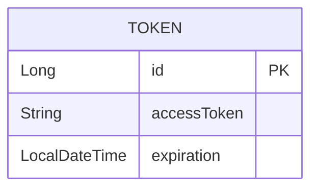
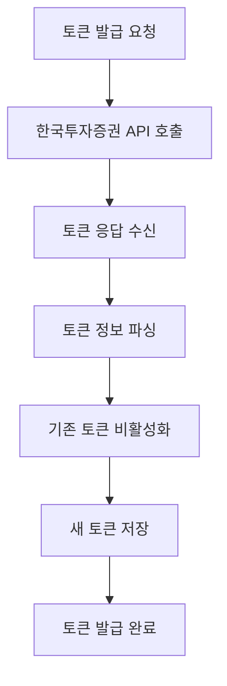
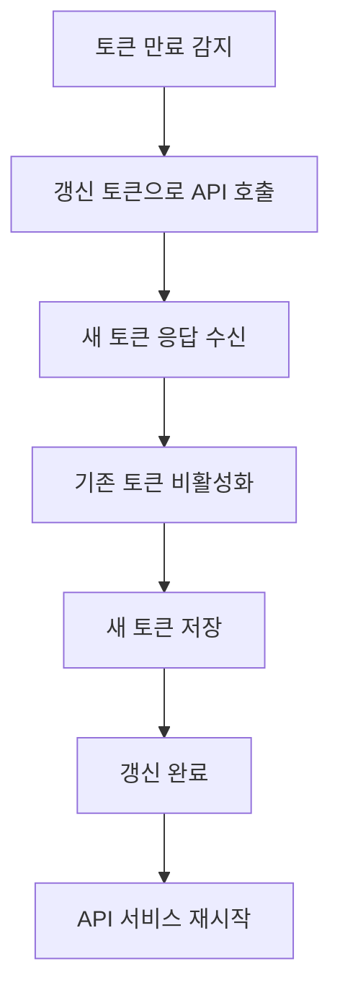

# Token Domain Documentation

## 📋 개요

Token 도메인은 한국투자증권 API 접근을 위한 토큰 관리 시스템을 담당합니다. API 토큰의 발급, 갱신, 검증을 통해 안정적인 외부 API 연동을 지원합니다.

## 🏗️ Entity 구조

### Token Entity 관계도



<details>
<summary>📄 Entity 코드 보기</summary>

```java
@Entity
@Getter
@Builder
@NoArgsConstructor
@AllArgsConstructor
public class Token {
    @Id
    @GeneratedValue(strategy = GenerationType.IDENTITY)
    private Long id;
    @Lob
    private String accessToken;
    private LocalDateTime expiration;
}
```

</details>

## 🔧 주요 기능

### 1. 토큰 발급

- **초기 토큰 발급**: 한국투자증권 API 접근을 위한 최초 토큰 발급
- **토큰 검증**: 발급된 토큰의 유효성 검증
- **토큰 저장**: 데이터베이스에 토큰 정보 저장

### 2. 토큰 갱신

- **자동 갱신**: 토큰 만료 전 자동 갱신
- **수동 갱신**: 필요 시 수동 토큰 갱신
- **갱신 실패 처리**: 갱신 실패 시 재시도 로직

### 3. 토큰 관리

- **토큰 상태 관리**: 활성/비활성 토큰 상태 관리
- **토큰 이력 관리**: 토큰 발급/갱신 이력 추적
- **토큰 보안**: 토큰 정보 암호화 및 보안 관리

## 📊 비즈니스 플로우

### 토큰 발급 플로우



### 토큰 갱신 플로우



## 🎯 API 엔드포인트

### Swagger UI 스크린샷


**주요 엔드포인트:**

- 토큰 관리는 내부 서비스로만 제공되며, 외부 API 엔드포인트는 제공하지 않습니다.
- `TokenService.getValidAccessToken()` - 현재 유효한 토큰 조회
- `TokenService.refreshTokenOnError()` - 토큰 만료 시 자동 갱신

## 📈 핵심 비즈니스 로직

### 1. 토큰 발급 로직

토큰 발급은 다음과 같은 단계로 진행됩니다:

1. **API 호출**: 한국투자증권 토큰 발급 API 호출
2. **응답 처리**: 발급된 토큰 정보 파싱
3. **기존 토큰 처리**: 기존 활성 토큰 비활성화
4. **새 토큰 저장**: 새로운 토큰 정보 데이터베이스 저장
5. **검증**: 저장된 토큰의 유효성 검증

### 2. 토큰 갱신 로직

토큰 갱신은 다음과 같이 작동합니다:

1. **만료 감지**: 토큰 만료 시간 확인
2. **갱신 요청**: refresh token을 사용한 갱신 API 호출
3. **응답 처리**: 새로운 토큰 정보 파싱
4. **토큰 교체**: 기존 토큰을 새 토큰으로 교체
5. **상태 업데이트**: 토큰 상태 정보 업데이트

### 3. 토큰 검증 로직

토큰 검증은 다음과 같은 조건을 확인합니다:

- **토큰 존재**: 데이터베이스에 토큰이 존재하는지 확인
- **만료 시간**: 토큰이 만료되지 않았는지 확인
- **자동 갱신**: 만료된 토큰 자동으로 새 토큰 발급

<details>
<summary>🔧 핵심 기술 구현</summary>

**API 연동**: RestTemplate을 통한 한국투자증권 토큰 API 호출

**토큰 폐기**: 기존 토큰 폐기 후 새 토큰 발급으로 보안 강화

**에러 처리**: 토큰 갱신 실패 시 재시도 로직 및 fallback 처리

**MapStruct**: DTO와 Entity 간의 매핑 처리

</details>

## 🔗 연관 도메인

### StockApiService (주식 API 서비스)

- 토큰을 사용하여 한국투자증권 API 호출
- TokenService를 통해 토큰 관리

## 📅 스케줄링

### 1. 토큰 갱신 스케줄

- **자동 갱신**: 토큰 만료 1시간 전 자동 갱신
- **상태 모니터링**: 토큰 상태 주기적 확인
- **에러 복구**: 갱신 실패 시 재시도

### 2. 토큰 정리 스케줄

- **만료 토큰 정리**: 만료된 토큰 주기적 삭제
- **비활성 토큰 정리**: 비활성 토큰 정리

## ✅ 구현 상태

### 핵심 기능 구현 현황

- [x] **토큰 발급**: 한국투자증권 API 토큰 발급 로직 구현 완료
- [x] **토큰 갱신**: 토큰 만료 시 자동 갱신 로직 구현 완료
- [x] **토큰 검증**: 토큰 유효성 검증 로직 구현 완료
- [x] **토큰 폐기**: 기존 토큰 폐기 로직 구현 완료
- [x] **내부 서비스**: TokenService를 통한 토큰 관리 구현 완료
- [ ] **스케줄링**: 토큰 자동 갱신 스케줄러 (향후 구현 예정)
- [ ] **토큰 암호화**: 토큰 정보 암호화 저장 (향후 구현 예정)
- [ ] **다중 토큰 지원**: 여러 API 서비스용 토큰 관리 (향후 구현 예정)

### 데이터 무결성 검증

- [x] **토큰 유효성 검증**: 토큰 형식 및 만료 시간 검증
- [x] **중복 토큰 방지**: 동시에 하나의 활성 토큰만 유지
- [x] **토큰 상태 관리**: 활성/비활성 상태 일관성 유지

## 🛡️ 보안 및 에러 처리

### 1. 토큰 보안

- **토큰 암호화**: 민감한 토큰 정보 암호화 저장
- **접근 제어**: 토큰 정보 접근 권한 제한
- **토큰 로테이션**: 정기적인 토큰 교체

### 2. 에러 처리

- **API 호출 실패**: 네트워크 오류 시 재시도
- **토큰 만료**: 만료된 토큰 자동 갱신
- **갱신 실패**: 갱신 실패 시 fallback 처리

### 3. 모니터링

- **토큰 상태 모니터링**: 토큰 상태 실시간 모니터링
- **API 호출 모니터링**: API 호출 성공/실패 모니터링
- **성능 모니터링**: 토큰 갱신 성능 모니터링

## 📈 성능 최적화

### 1. 토큰 캐싱

- **메모리 캐싱**: 자주 사용되는 토큰 정보 메모리 캐싱
- **Redis 캐싱**: 분산 환경에서 토큰 정보 공유
- **캐시 무효화**: 토큰 갱신 시 캐시 무효화

### 2. API 호출 최적화

- **연결 풀링**: HTTP 연결 풀을 통한 성능 최적화
- **타임아웃 설정**: 적절한 타임아웃 설정으로 응답 시간 최적화
- **배치 처리**: 대량 토큰 갱신 시 배치 처리

<details>
<summary>🚀 확장 가능성</summary>

### 1. 다중 API 지원

- **다중 증권사**: 여러 증권사 API 토큰 관리
- **다중 서비스**: 다양한 외부 서비스 토큰 관리
- **토큰 그룹화**: 서비스별 토큰 그룹 관리

### 2. 고급 보안 기능

- **토큰 암호화**: AES 암호화를 통한 토큰 보안 강화
- **토큰 분할**: 토큰을 여러 부분으로 분할 저장
- **동적 토큰**: 시간 기반 동적 토큰 생성

### 3. 모니터링 및 알림

- **토큰 만료 알림**: 토큰 만료 전 알림
- **갱신 실패 알림**: 토큰 갱신 실패 시 알림
- **사용량 모니터링**: API 호출 사용량 모니터링

### 4. 자동화 기능

- **자동 토큰 교체**: 정기적인 토큰 자동 교체
- **장애 복구**: 토큰 관련 장애 자동 복구
- **백업 토큰**: 주 토큰 실패 시 백업 토큰 사용
</details>

---

_이 문서는 Motoo 프로젝트의 Token 도메인 설계를 설명합니다._
