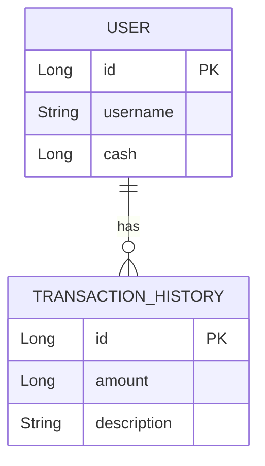
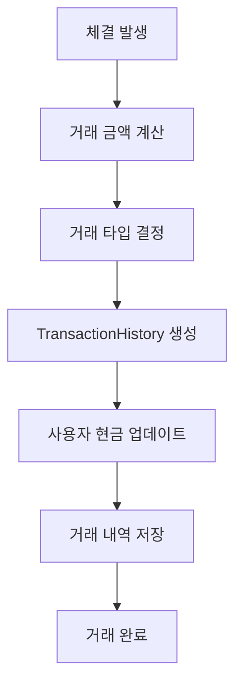
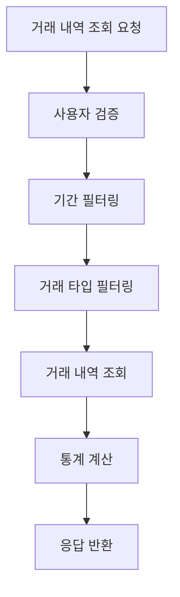

# Transaction Domain Documentation

## 📋 개요

Transaction 도메인은 주식 거래와 관련된 현금 거래 내역을 관리하는 핵심 도메인입니다. 매수/매도 체결 시 발생하는 현금 흐름을 추적하고, 사용자의 거래 이력을 관리합니다.

## 🏗️ Entity 구조

### Transaction Entity 관계도



<details>
<summary>📄 Entity 코드 보기</summary>

```java
@Entity
@Getter
@NoArgsConstructor(access = lombok.AccessLevel.PROTECTED)
public class TransactionHistory extends BaseEntity {
    @Id
    @GeneratedValue(strategy = GenerationType.IDENTITY)
    private Long id;

    @ManyToOne(fetch = FetchType.LAZY)
    @JoinColumn(name = "user_id")
    private User user;

    @Column(nullable = false)
    private Long amount;

    @Column(nullable = false, length = 100)
    private String description; // 예: "매수 체결", "입금", "퀴즈 보상" 등
}
```

</details>

## 🔧 주요 기능

### 1. 거래 내역 관리

- **거래 기록**: 매수/매도 체결 시 현금 거래 내역 기록
- **거래 조회**: 사용자별, 기간별 거래 내역 조회
- **거래 통계**: 거래 건수, 거래대금, 수수료 집계

### 2. 현금 흐름 추적

- **현금 입출금**: 매수 시 현금 차감, 매도 시 현금 증가
- **잔고 관리**: 실시간 현금 잔고 추적
- **거래 검증**: 거래 금액과 잔고 일치성 검증

### 3. 거래 분석

- **거래 패턴 분석**: 사용자별 거래 패턴 분석
- **수익률 계산**: 거래 내역 기반 수익률 계산
- **거래 통계**: 거래 빈도, 평균 거래 금액 등

## 📊 비즈니스 플로우

### 거래 내역 생성 플로우



### 거래 내역 조회 플로우



## 🎯 API 엔드포인트

### Swagger UI 스크린샷


**주요 엔드포인트:**

- 거래 내역 관리는 내부 서비스로만 제공되며, 외부 API 엔드포인트는 제공하지 않습니다.
- `TransactionService.getTransactions()` - 사용자별 거래 내역 조회
- `TransactionService.getTransactionsByDescription()` - 설명별 거래 내역 조회
- `TransactionService.getTransactionsByDateRange()` - 기간별 거래 내역 조회

## 📈 핵심 비즈니스 로직

### 1. 거래 내역 조회 로직

거래 내역 조회는 다음과 같은 단계로 진행됩니다:

1. **사용자 검증**: 유효한 사용자인지 확인
2. **필터링 조건 적용**: 설명별, 기간별 필터링 조건 적용
3. **페이지네이션 처리**: 대용량 데이터의 효율적인 조회
4. **거래 내역 조회**: 조건에 맞는 거래 내역 조회
5. **응답 구성**: 조회된 거래 내역 반환

### 2. 거래 내역 필터링

거래 내역은 다음과 같은 조건으로 필터링됩니다:

- **사용자별**: 특정 사용자의 거래 내역만 조회
- **설명별**: 특정 설명(매수, 매도, 입금 등)의 거래 내역만 조회
- **기간별**: 특정 기간의 거래 내역만 조회

### 3. 페이지네이션 처리

대용량 거래 내역 조회를 위한 페이지네이션:

- **페이지 단위**: 한 번에 조회할 거래 내역 수 제한
- **정렬**: 거래 내역을 ID 기준 내림차순 정렬
- **효율성**: 대용량 데이터의 효율적인 조회 지원

<details>
<summary>🔧 핵심 기술 구현</summary>

**페이지네이션**: 대용량 거래 내역 조회 시 효율적인 페이지네이션 처리

**필터링**: 사용자별, 설명별, 기간별 거래 내역 필터링

**쿼리 최적화**: JPA Query를 활용한 효율적인 데이터 조회

**트랜잭션 관리**: `@Transactional`을 사용한 데이터 일관성 보장

</details>

## 🔗 연관 도메인

### User (사용자)

- 거래를 발생시킨 사용자
- TransactionHistory Entity와 N:1 관계

### User (사용자)

- 거래를 발생시킨 사용자
- TransactionHistory Entity와 N:1 관계

## 📊 거래 데이터 분석

### 1. 거래 패턴 분석

- **거래 빈도**: 사용자별 거래 빈도 분석
- **거래 시간**: 거래 발생 시간대 분석
- **거래 금액**: 거래 금액 분포 분석

### 2. 수익률 분석

- **거래별 수익률**: 개별 거래 수익률 계산
- **기간별 수익률**: 기간별 누적 수익률 계산
- **포트폴리오 수익률**: 전체 포트폴리오 수익률

### 3. 리스크 분석

- **거래 리스크**: 거래 패턴 기반 리스크 분석
- **손실 분석**: 손실 거래 패턴 분석
- **변동성 분석**: 거래 금액 변동성 분석

## ✅ 구현 상태

### 핵심 기능 구현 현황

- [x] **TransactionHistory Entity**: 완전한 Entity 구조 구현 완료
- [x] **거래 내역 조회**: 사용자별, 설명별, 기간별 거래 내역 조회 구현 완료
- [x] **페이지네이션**: 대용량 거래 내역 조회 시 페이지네이션 지원
- [x] **내부 서비스**: TransactionService를 통한 거래 내역 관리 구현 완료
- [ ] **거래 내역 생성**: 체결 시 자동 거래 내역 생성 로직 (향후 구현 예정)
- [ ] **현금 흐름 추적**: 매수/매도에 따른 현금 흐름 추적 (향후 구현 예정)
- [ ] **고급 분석 기능**: 거래 패턴 분석, 리스크 분석 (향후 구현 예정)

### 데이터 무결성 검증

- [x] **거래 데이터 검증**: 거래 금액, 거래 타입 유효성 검사
- [x] **잔고 일치성 검증**: 거래 후 잔고와 거래 내역 일치성 검증
- [x] **트랜잭션 관리**: 거래 내역 생성과 잔고 업데이트의 원자성 보장

## 🛡️ 데이터 무결성

### 1. 거래 데이터 검증

- **거래 금액 검증**: 거래 금액의 유효성 검사
- **거래 타입 검증**: 거래 타입의 유효성 검사
- **거래 시간 검증**: 거래 시간의 일관성 검사

### 2. 잔고 일치성 검증

- **거래 전후 잔고**: 거래 전후 잔고 변화 검증
- **거래 내역 합계**: 거래 내역 합계와 잔고 일치성 검증
- **실시간 검증**: 거래 발생 시 실시간 잔고 검증

### 3. 트랜잭션 관리

- **원자성**: 거래 내역 생성과 잔고 업데이트의 원자성
- **일관성**: 관련 데이터 간의 일관성 유지
- **격리성**: 동시 거래 처리 시 격리 수준 보장

## 📈 성능 최적화

### 1. 쿼리 최적화

- **인덱스 활용**: (user_id, transaction_date), (transaction_type, transaction_date) 인덱스
- **페이지네이션**: 대용량 거래 내역 조회 시 페이지네이션
- **집계 쿼리**: 거래 통계를 위한 집계 쿼리 최적화

### 2. 캐싱 전략

- **거래 통계 캐싱**: 계산된 거래 통계 데이터 캐싱
- **잔고 캐싱**: 사용자 잔고 정보 캐싱
- **거래 패턴 캐싱**: 분석된 거래 패턴 데이터 캐싱

<details>
<summary>🚀 확장 가능성</summary>

### 1. 고급 분석 기능

- **머신러닝 분석**: 거래 패턴 기반 머신러닝 분석
- **예측 분석**: 거래 패턴 기반 미래 거래 예측
- **이상 거래 탐지**: 비정상적인 거래 패턴 탐지

### 2. 실시간 기능

- **실시간 거래 알림**: 거래 발생 시 실시간 알림
- **실시간 대시보드**: 실시간 거래 현황 대시보드
- **실시간 분석**: 실시간 거래 패턴 분석

### 3. 리포트 기능

- **거래 리포트**: 월별/분기별 거래 리포트
- **세금 계산**: 양도소득세 계산 및 신고 지원
- **성과 분석**: 거래 기반 투자 성과 분석

### 4. 보안 기능

- **거래 검증**: 2차 검증을 통한 거래 보안 강화
- **이상 거래 차단**: 비정상 거래 자동 차단
- **거래 이력 추적**: 상세한 거래 이력 추적
</details>

---

_이 문서는 Motoo 프로젝트의 Transaction 도메인 설계를 설명합니다._
