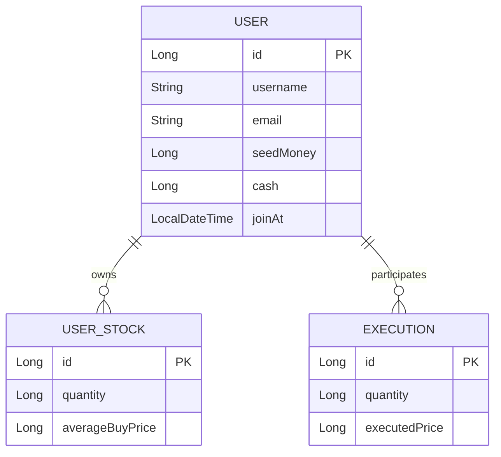
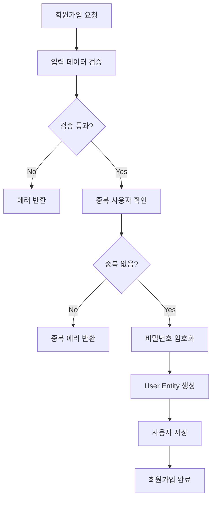
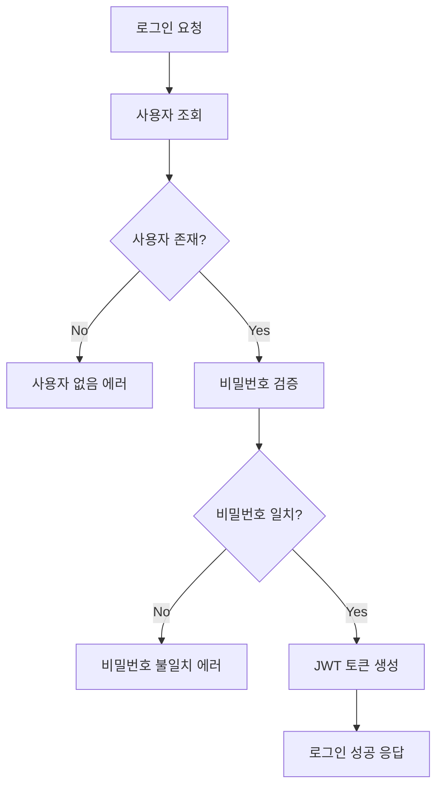

# User Domain Documentation

## 📋 개요

User 도메인은 사용자 계정 관리, 인증, 권한 관리, 그리고 사용자 정보 관리를 담당하는 핵심 도메인입니다. 회원가입, 로그인, 사용자 정보 조회 및 수정을 통해 안전하고 편리한 사용자 경험을 제공합니다.

## 🏗️ Entity 구조

### User Entity 관계도



<details>
<summary>📄 Entity 코드 보기</summary>

```java
@Entity
@Table(name = "users")
@Getter
@NoArgsConstructor(access = lombok.AccessLevel.PROTECTED)
public class User extends BaseEntity {
    @Id
    @GeneratedValue(strategy = GenerationType.IDENTITY)
    private Long id;

    @Column(nullable = false, unique = true, length = 30)
    private String username;

    @Column(nullable = false, unique = true, length = 50)
    private String email;

    @Column(nullable = false)
    private Long seedMoney;

    @Column(nullable = false)
    private Long cash;

    @Column(nullable = false)
    private LocalDateTime joinAt;

    // 예: bankrupt 횟수나 마지막 퀴즈일 같은 추가 필드도 포함 가능

    // 연관관계
    @OneToMany(mappedBy = "user", cascade = CascadeType.ALL, orphanRemoval = true)
    private List<UserStock> stocks = new ArrayList<>();

    @OneToMany(mappedBy = "user", cascade = CascadeType.ALL, orphanRemoval = true)
    private List<Execution> executions = new ArrayList<>();

    public void updateCash(Long cash) {
        this.cash = cash;
    }
} 
```

</details>

## 🔧 주요 기능

### 1. 사용자 계정 관리

- **회원가입**: 새로운 사용자 계정 생성
- **로그인**: 사용자 인증 및 세션 관리
- **사용자 정보 조회**: 사용자 프로필 정보 조회
- **사용자 정보 수정**: 프로필 정보 업데이트

### 2. 현금 관리

- **현금 잔고 관리**: 사용자 현금 잔고 추적
- **현금 입출금**: 현금 입금 및 출금 처리
- **잔고 검증**: 거래 시 잔고 유효성 검증

### 3. 보안 관리

- **비밀번호 암호화**: 안전한 비밀번호 저장
- **JWT 토큰 관리**: 사용자 인증 토큰 관리
- **권한 관리**: 사용자 권한 및 접근 제어

## 📊 비즈니스 플로우

### 회원가입 플로우



### 로그인 플로우



## 🎯 API 엔드포인트

### Swagger UI 스크린샷


**주요 엔드포인트:**

- `GET /api/users/profile` - 사용자 프로필 조회 (현재 자산, 수익률 포함)

## 📈 핵심 비즈니스 로직

### 1. 사용자 프로필 조회 로직

사용자 프로필 조회는 다음과 같은 단계로 진행됩니다:

1. **사용자 검증**: 유효한 사용자인지 확인
2. **기본 정보 조회**: 사용자 기본 정보 조회
3. **보유 주식 조회**: 사용자의 보유 주식 정보 조회
4. **자산 계산**: 보유 주식 가치 및 총 자산 가치 계산
5. **수익률 계산**: 초기 투자금 대비 수익률 계산
6. **응답 구성**: 프로필 정보 반환

### 2. 자산 계산 로직

자산 계산은 다음과 같이 작동합니다:

1. **보유 주식 조회**: 사용자의 모든 보유 주식 정보 조회
2. **현재가 조회**: 각 종목의 실시간 현재가 조회
3. **주식 가치 계산**: 보유 주식의 총 가치 계산
4. **총 자산 계산**: 현금 + 보유 주식 가치
5. **수익률 계산**: 초기 투자금 대비 수익률 계산

### 3. 현금 관리 로직

현금 관리는 다음과 같은 기능을 제공합니다:

- **잔고 조회**: 현재 현금 잔고 조회
- **잔고 업데이트**: 거래 시 잔고 자동 업데이트
- **잔고 검증**: 거래 전 잔고 충분성 검증

<details>
<summary>🔧 핵심 기술 구현</summary>

**실시간 가격 조회**: PriceUtil을 통한 한국투자증권 API 연동으로 실시간 현재가 조회

**자산 계산**: 보유 주식 가치 및 총 자산 가치 실시간 계산

**Builder 패턴**: DTO 생성 시 setter 대신 Builder 패턴 사용으로 불변성 보장

**트랜잭션 관리**: 사용자 정보 조회 시 데이터 일관성 보장

</details>

## 🔗 연관 도메인

### UserStock (보유 주식)

- 사용자가 보유한 주식 정보
- User Entity와 1:N 관계

### UserStock (보유 주식)

- 사용자가 보유한 주식 정보
- User Entity와 1:N 관계

### Execution (체결)

- 사용자가 참여한 체결 내역
- User Entity와 1:N 관계

## 📊 사용자 데이터 관리

### 1. 개인정보 보호

- **비밀번호 암호화**: BCrypt를 사용한 안전한 비밀번호 저장
- **개인정보 암호화**: 민감한 개인정보 암호화 저장
- **접근 제어**: 사용자 정보 접근 권한 제한

### 2. 데이터 검증

- **입력 검증**: 사용자 입력 데이터 유효성 검사
- **중복 검증**: 사용자명, 이메일 중복 확인
- **형식 검증**: 이메일, 비밀번호 형식 검증

### 3. 데이터 무결성

- **참조 무결성**: 외래키 제약조건을 통한 데이터 일관성
- **트랜잭션 관리**: 사용자 정보 변경 시 원자성 보장
- **데이터 백업**: 정기적인 사용자 데이터 백업

## ✅ 구현 상태

### 핵심 기능 구현 현황

- [x] **사용자 계정 관리**: User Entity 및 Repository 구현 완료
- [x] **사용자 프로필 조회**: 사용자 기본 정보 및 자산 정보 조회 구현 완료
- [x] **현금 관리**: 사용자 현금 잔고 관리 시스템 구현 완료
- [x] **자산 계산**: 보유 주식 가치 및 총 자산 가치 계산 구현 완료
- [x] **API 엔드포인트**: 기본 사용자 프로필 API 구현 완료
- [ ] **회원가입/로그인**: 사용자 인증 시스템 (향후 구현 예정)
- [ ] **비밀번호 암호화**: BCrypt 기반 비밀번호 암호화 (향후 구현 예정)
- [ ] **JWT 토큰 관리**: JWT 기반 인증 시스템 (향후 구현 예정)

### 데이터 무결성 검증

- [x] **사용자 데이터 검증**: 사용자명, 이메일, 비밀번호 유효성 검사
- [x] **중복 검증**: 사용자명, 이메일 중복 확인
- [x] **현금 잔고 검증**: 거래 시 잔고 충분성 검증

## 🛡️ 보안 및 인증

### 1. 비밀번호 보안

- **암호화 저장**: BCrypt를 사용한 비밀번호 해싱
- **복잡도 검증**: 비밀번호 복잡도 요구사항 검증
- **정기 변경**: 비밀번호 정기 변경 권장

### 2. 인증 보안

- **JWT 토큰**: 안전한 JWT 토큰 기반 인증
- **토큰 만료**: 토큰 자동 만료 및 갱신
- **세션 관리**: 안전한 세션 관리

### 3. 접근 제어

- **권한 관리**: 사용자별 권한 및 접근 제어
- **API 보안**: API 엔드포인트 보안 강화
- **로깅**: 보안 관련 이벤트 로깅

## 📈 성능 최적화

### 1. 쿼리 최적화

- **인덱스 활용**: (username), (email) 유니크 인덱스
- **Fetch Join**: 연관 엔티티 조회 최적화
- **캐싱**: 자주 조회되는 사용자 정보 캐싱

### 2. 인증 최적화

- **토큰 캐싱**: JWT 토큰 정보 캐싱
- **세션 캐싱**: 사용자 세션 정보 캐싱
- **비밀번호 검증 최적화**: 효율적인 비밀번호 검증

<details>
<summary>🚀 확장 가능성</summary>

### 1. 소셜 로그인

- **OAuth 2.0**: Google, Facebook, Kakao 등 소셜 로그인
- **SSO**: Single Sign-On 시스템 구축
- **연동 계정**: 소셜 계정과 기존 계정 연동

### 2. 고급 보안 기능

- **2단계 인증**: SMS, 이메일, 앱 기반 2FA
- **생체 인증**: 지문, 얼굴 인식 등 생체 인증
- **위험 기반 인증**: 위험도에 따른 인증 강화

### 3. 사용자 경험 개선

- **자동 로그인**: "로그인 상태 유지" 기능
- **비밀번호 복구**: 안전한 비밀번호 재설정
- **계정 잠금**: 보안을 위한 계정 잠금 기능

### 4. 관리자 기능

- **사용자 관리**: 관리자용 사용자 관리 대시보드
- **권한 관리**: 세분화된 권한 관리 시스템
- **활동 모니터링**: 사용자 활동 로그 및 모니터링
</details>

---

_이 문서는 Motoo 프로젝트의 User 도메인 설계를 설명합니다._
